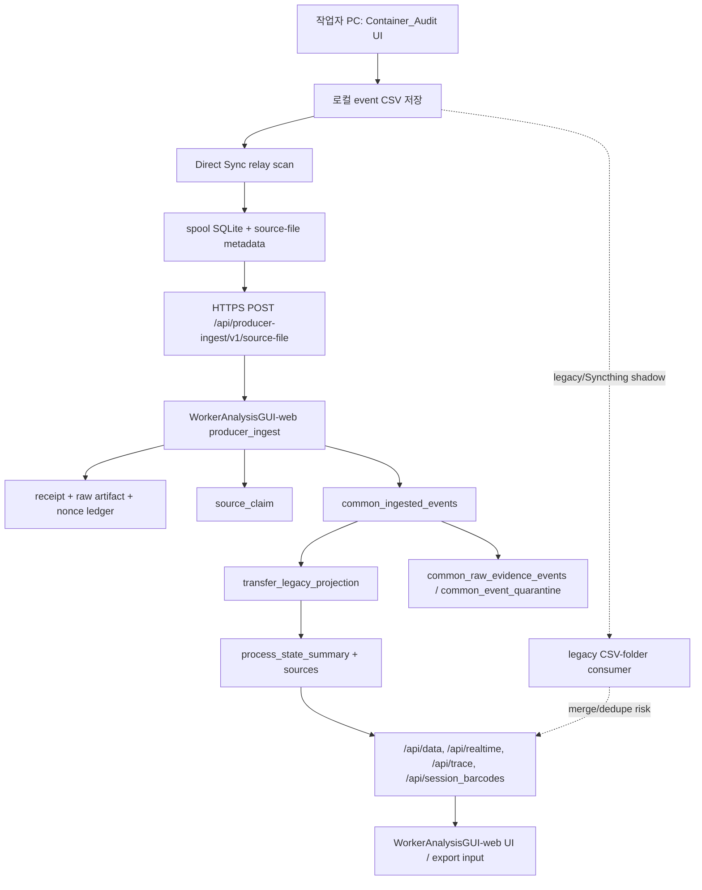

# Cross-Program Data Flow Audit - 2026-06-28

검증 시각: 2026-06-28 07:17 KST

## 결론

현재 구조는 `Container_Audit -> Direct Sync HTTPS -> WorkerAnalysisGUI-web ingest -> common projection -> dashboard/API`까지 연결되어 있고, 로컬 대표 테스트와 운영 서버 read-only 상태 확인 기준으로 핵심 배관은 동작한다.

하지만 Syncthing 제거와 production cutover를 "엄격 통과"로 선언하기에는 아직 P0/P1 리스크가 남아 있다. 2026-06-28 working tree에서는 live CSV writer/reader 경계, 제품 바코드 fail-closed, `/api/worker_hourly` projection fallback, receipt row-count/range 검증, self-enrollment disabled credential 보호, Defect reject payload identity/UOM을 로컬 보강했다. 남은 핵심 blocker는 Syncthing shadow double-count 증명, 실제 endpoint/현장/rollback 증거, 운영 배포본과 로컬 코드 parity이다.

## 전체 데이터 플로우

## 5-agent 검증 범위

1. Producer/Container_Audit agent
   - 이벤트 생성, 로컬 저장, Direct Sync source plan, spool, idempotency, receipt 처리 확인.
   - `TRAY_COMPLETE`는 동기 CSV 기록 후 relay 대상이 된다.
   - 최신 보강: relay가 active writer `.lock`, read 중 size/mtime 변경, trailing partial row를 보면 해당 주기 전송을 미룬다.

2. HTTPS/server agent
   - 운영 endpoint `https://worker.kmtecherp.com/api/producer-ingest/v1/source-file` 확인.
   - OPTIONS 응답: `POST, OPTIONS`, Cloudflare/TLS/HSTS 확인.
   - `/health/ingest` 기준 `COMMON_INGEST_WRITE_ENABLED=true`, `PROJECTION_API_READ_ENABLED=true`, schema healthy.
   - P0/P1: SSH read-only parity 확인은 2026-06-28 08:07 KST에 timeout으로 미완료다. 배포 서버 스크립트와 로컬 스크립트의 정확한 SHA/version 대조가 아직 필요하다.

3. DB ingest/projection agent
   - `producer_ingest_receipts`, `producer_ingest_raw_artifacts`, `source_claim`, `common_ingested_events`, `common_event_quarantine`, `transfer_legacy_projection`, `process_state_summary` 플로우 확인.
   - 20PC fixture는 receipt/raw/source_claim/common/projection/summary count 정합성을 검증한다.
   - P1: quarantine-only accepted upload는 receipt가 있어도 source_claim이 없을 수 있다. reconciliation 기준에서 명시적으로 분기해야 한다.

4. Downstream consumer agent
   - 실제 HTTP receiver와 legacy CSV-folder consumer 확인.
   - `/api/data`, `/api/realtime`, `/api/trace`, `/api/session_barcodes`는 projection fallback 경로가 있다.
   - 최신 보강: `/api/worker_hourly`는 projection fallback을 사용하도록 수정됐다. legacy desktop consumer의 nested `master_label_fields` 수신은 별도 운영 검증이 필요하다.

5. Integrity/security/concurrency agent
   - Syncthing shadow, 중복/충돌, 악성 입력, row identity, delta replay 관점 확인.
   - P0: legacy CSV dashboard path와 direct projection path 사이의 no-double-count는 아직 엄격히 증명되지 않았다.
   - 최신 보강: product barcode input은 control char, formula prefix, HTML/script, path traversal, overlong input을 producer 단계에서 fail-closed 한다. 실제 라벨에서 나올 수 있는 `/`, `&`, `;`, `|`, 따옴표는 traversal/script/control 문맥이 아니면 과차단하지 않는다.

## 직접 실행한 증거

### 로컬 대표 테스트

아래 테스트는 2026-06-28 KST에 이 PC에서 재실행했다.

- `WorkerAnalysisGUI-web`
  - `test_container_audit_direct_tray_complete_projects_transfer_waiting`
  - `test_container_audit_tray_complete_twenty_pc_concurrent_projection_and_replay`
  - `test_container_audit_direct_ingest_treats_worker_pc_injection_payload_as_data`
  - 결과: `3 passed in 3.60s`

- `Container_Audit`
  - `test_tray_complete_payload_round_trips_to_direct_sync_source_plan`
  - `test_multi_pc_same_completion_file_uses_distinct_direct_sync_identity`
  - `test_runtime_lost_ack_retry_reuses_same_batch_and_idempotency_after_stale_lease`
  - 결과: `3 passed, 1 warning in 0.71s`
  - warning은 pygame/pkg_resources deprecation이며 이번 data-flow 판정과 무관하다.

이번 루프에서 더 넓은 targeted suite도 통과했다.

- `WorkerAnalysisGUI-web`: 307 passed
- `Container_Audit`: 136 passed, 1 warning (`pygame/pkg_resources` deprecation)
- `Defect_Inspection`: 233 passed
- 합계: 676 targeted tests passed

### 운영 서버 read-only 확인

`curl -X OPTIONS https://worker.kmtecherp.com/api/producer-ingest/v1/source-file`

- HTTP 200
- `Allow: POST, OPTIONS`
- Cloudflare 경유
- HSTS 확인

`curl https://worker.kmtecherp.com/health/ingest`

- `status=healthy`
- `common_projection_schema=healthy`
- `COMMON_INGEST_WRITE_ENABLED=true`
- `PROJECTION_API_READ_ENABLED=true`
- `PROJECTION_SHADOW_ENABLED=true`
- `common_ingested_events=799`
- `common_event_quarantine=596`
- `process_state_summary=49`

서버 read-only ops status:

- status: `PASS`
- production_ready: `false`
- missing_tables: none
- direct receipts: 69 accepted
- direct receipts by stream:
  - `container_audit_events`: 11
  - `defect_return_events`: 31
  - `label_match_events`: 21
  - `rework_product_events`: 6
- source_claim: 23, all `direct_receipted`
- source_claim by stream:
  - `container_audit_events`: 4
  - `label_match_events`: 15
  - `rework_product_events`: 4
- common projection:
  - `container_audit`: 16
  - `label_match`: 454
  - `defect_return_bundle_ledger`: 314
  - `inspection_worker_product_ledger`: 15
- defect HMAC poisoned chain: 2

이 운영 status는 "현재 DB 테이블과 일부 direct receipts가 정상 존재한다"는 증거다. `production_ready=false`이므로 Syncthing 제거 승인 증거로는 부족하다.

## 엄격 판정

### 통과로 볼 수 있는 부분

- Container_Audit가 표준 CSV schema `timestamp, worker_name, event, details`로 event log를 만든다.
- Direct Sync source plan은 row count, first/last row, content SHA-256, source host/install identity, idempotency key를 만든다.
- 같은 파일명/같은 작업자명이 20PC에서 동시에 올라와도 source_host_id와 producer_install_id로 분리되는 로컬 테스트가 있다.
- 서버 ingest는 TLS endpoint, HMAC/nonce/idempotency/receipt/raw artifact/common projection 경로를 갖고 있다.
- common projection은 Container Audit `TRAY_COMPLETE`를 `TRANSFER_LEGACY`로 투영하고 summary/source lineage를 보존한다.
- 웹 dashboard의 주요 조회 API는 projection fallback을 대부분 갖고 있다.
- 운영 서버 DB에는 direct receipts, source_claim, common projection, quarantine 테이블이 존재하고 read-only status는 PASS다.

### 2026-06-28 working-tree 보강 결과

이번 루프에서 로컬 코드로 줄인 항목:

1. Live CSV delta relay atomicity
   - `Container_Audit/tools/direct_sync_relay_runner.py`가 active writer `.lock` 파일을 보면 스캔을 미룬다.
   - delta 읽기 전후 size/mtime double-read가 달라지면 해당 주기를 미룬다.
   - 마지막 줄이 newline으로 끝나지 않은 partial row는 spool에 넣지 않고 완료된 줄까지만 end byte watermark를 기록한다.
   - ack 후 원본 파일이 같은 이름으로 교체되어도 ack watermark는 현재 파일을 다시 해시하지 않고, spooled 당시 원본 prefix hash를 저장한다.
   - 검증: `python -m pytest tests/test_direct_sync_relay_runner.py tests/test_direct_sync_push.py -q` 포함 Container focused suite -> `136 passed`.

2. Product barcode fail-closed validation
   - `Container_Audit/product_scan.py`가 control char, formula prefix, HTML/script marker, path traversal marker, 과도한 길이의 제품 바코드를 정상 스캔으로 인정하지 않는다.
   - slash/ampersand/semicolon/pipe/quote 등 정상 라벨 separator는 공격 문맥이 아니면 허용한다.
   - unsafe format failure는 raw barcode를 로그에 남기지 않고 SHA-256/길이/사유만 남긴다.
   - 검증: `python -m pytest tests/test_product_scan.py ... -q` 포함 Container focused suite -> `136 passed`.

3. Downstream `/api/worker_hourly` projection fallback
   - `WorkerAnalysisGUI-web/app.py`가 `/api/worker_hourly`에서도 legacy sessions만 보지 않고 projection fallback 세션을 읽는다.
   - projection fallback은 화면에 표시되는 세션 local date 기준으로 start/end date를 필터링해 KST 자정 근처 작업을 누락하지 않는다.
   - `get_bundle_trace()`는 direct rework `inspection_bundle_projection`을 같이 반환하고, trace row는 payload의 manifest identity를 승격한다.
   - `process_state`/`process_state_summary` API는 `quantity_basis`, `qty_uom`, `measure_code`를 노출한다.
   - 검증: `WorkerAnalysisGUI-web` ingest/dashboard/credential/projection focused suite `307 passed`.

4. DB row-count reconciliation evidence
   - `producer_ingest_receipts`에 `declared_row_count`, `declared_first_row_number`, `declared_last_row_number` additive 컬럼을 추가했다.
   - accepted receipt JSON에도 `source_file` 요약으로 content hash, byte length, declared row range를 남긴다.
   - declared row range는 `row_count == last-first+1` 규칙으로 검증하고, 같은 idempotency key 재전송에서 row range가 바뀌면 conflict로 막는다.
   - 검증: `WorkerAnalysisGUI-web` focused suite `307 passed`.

5. Defect/warehouse payload contract
   - `RETURN_PRODUCT_ACCEPTED`, `RETURN_DISPATCHED`, `WAREHOUSE_TRANSFER_RECEIVED`, `WAREHOUSE_TRANSFER_REJECTED`, linked intake start-failure reject payload에 product/manifest identity와 quantity UOM을 보강했다.
   - 검증: `Defect_Inspection` contract/direct-sync HMAC focused suite `233 passed`.

6. Self-enrollment credential safety
   - 기존 self-enrolled row가 disabled/revoked 상태이면 같은 PC가 다시 enroll을 호출해도 active로 되살리지 않는다.
   - Defect HMAC registry 병합은 DB credential write 성공 후 수행하며, DB write 실패 시 active HMAC key가 registry에 남지 않는다.
   - 검증: Worker self-enrollment focused tests 포함 `307 passed`.

### 배포 전 남은 P0 blocker

1. Syncthing shadow no-double-count 증명 부족
   - direct projection path와 legacy CSV-folder/dashboard path가 동시에 켜진 상태에서 최종 화면 count가 1회만 잡히는지 운영 동등 데이터로 재증명해야 한다.
   - legacy parser는 source_host_id/producer_install_id/source_file_id/row hash를 갖지 못해 엄격 dedupe 근거가 약하다.

2. 운영 배포 parity 차이
   - 서버의 `direct_sync_ops_status.py`는 로컬과 CLI 인자가 다르다.
   - 서버 배포본과 로컬 검증본의 정확한 commit/version/hash를 맞춰야 한다.

3. 실제 endpoint/현장 증거 부족
   - 이번 보강은 로컬 working tree와 테스트 DB 기준이다.
   - 승인된 staging/test HTTPS endpoint, 실제 작업자 PC/스캐너, 20PC/장시간, rollback rehearsal, 다운스트림 수신 프로그램 화면을 묶은 운영 동등 증거가 아직 필요하다.

### P1 risk

- receipt JSON은 DB inline 중심이고, 별도 durable receipt artifact 저장은 아직 과도기적이다.
- quarantine-only upload는 source_claim count와 receipt count가 1:1이 아닐 수 있다.
- HMAC CSV stream은 source_claim이 아니라 chain state가 소유하므로 reconciliation 기준을 stream별로 다르게 해야 한다.
- raw artifact compression/cold lifecycle은 문서화되어 있으나 현재 `compression_algorithm='none'` 중심이다.
- legacy desktop consumer는 nested `master_label_fields`를 제대로 읽지 못할 수 있다.
- normal Container_Audit row에는 row-level event_id/sequence/payload_hash가 부족하다.
- local CSV timestamp는 timezone-aware가 아니다.

## 배포 전 통과 기준

Syncthing 제거 전에는 최소한 아래가 PASS여야 한다.

1. shadow run에서 direct + Syncthing legacy가 동시에 켜져도 dashboard/API/export 총량이 double count 되지 않는다는 운영 동등 증거.
2. `/api/worker_hourly` 포함 downstream 화면/API가 배포 서버에서도 common projection fallback 또는 direct-query 경로를 쓰는지 확인.
3. producer barcode/input fail-closed가 실제 UI/CSV/HTTPS/DB/dashboard/export에서 안전하다는 악성 입력 현장 증거.
4. 운영 서버 배포본 commit/hash와 로컬 검증본 commit/hash 일치.
5. approved endpoint의 TLS/HMAC/nonce/idempotency/receipt/raw/common/projection/summary row-count reconciliation PASS.
6. rollback rehearsal, operator report, production_ready=false 해소 근거를 포함한 evidence bundle PASS.

## 다음 개선 우선순위

1. Syncthing shadow no-double-count 테스트/운영 증거 패키지 최신화.
2. 서버 배포 parity checker를 추가해 local/server script hash, app commit, schema version을 한 번에 비교.
3. 승인 endpoint에서 1PC canary -> 20PC/VM concurrency -> soak 순서로 receipt/raw/common/projection/summary 대조.
4. WorkerAnalysisGUI-web/Inspection_worker downstream 화면에서 당일/과거/trace/export 재검증.
5. rollback rehearsal과 operator visibility report를 실제 절차로 캡처.
