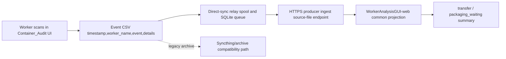

# Container_Audit Local Audit Readiness Report

작성일: 2026-06-24
대상: 이적실 `Container_Audit` 및 HTTPS direct-sync 전환

## Executive Status

- Local/headless verification status: PASS.
- Latest Container_Audit suite: `797 passed, 1 warning`.
- WorkerAnalysisGUI-web downstream targeted gate: `187 passed`.
- Company server read-only precheck: Syncthing peer `Server` is connected and FQDN HTTPS producer route `OPTIONS` returns 200, but direct upload is not ready because no POST/HMAC/nonce/idempotency/receipt path was tested, producer credentials are not provisioned locally, and `/health/ingest` remains 503 blocked by promotion evidence.
- Operational DB read-only audit: legacy dashboard DB is live and healthy, but direct ingest is blocked because `producer_ingest_receipts`, `producer_ingest_nonces`, `producer_ingest_raw_artifacts`, `source_claim`, `transfer_legacy_projection`, and `process_state_summary_sources` are missing; deployed `direct_sync_ops_status.py` also reports `BLOCKED`.
- Release config precheck: checker and builder hardened against forbidden secret/endpoint/debug/fault markers; current workspace `config` is not release-ready because `config\parked_trays` is runtime-local, but `tools\build_release_config.py` can generate a clean checked release config directory.
- Live POST upload, production HTTPS endpoint mutation, production DB mutation, scheduled-task apply: not executed and still require explicit approval.
- Cutover readiness: local fixture readiness improved; production cutover is not approved from local evidence alone.

## Completed Local Evidence

| Area | Evidence | Status |
| --- | --- | --- |
| Human workflow map | `docs/WORKFLOW_UIUX_HTTPS_E2E_CHECKLIST.md` covers login, scan, buttons, replacement, exchange, close, idle, updater | PASS |
| Field runbook | `docs/FIELD_UI_HTTPS_CUTOVER_RUNBOOK.md` defines actual scanner/UI, HTTPS, multi-PC, downstream, rollback, evidence pack steps | PASS |
| Pre-production validation matrix | `docs/PRE_PRODUCTION_VALIDATION_MATRIX_20260625.md` maps every P0/P1/P2 gate to local status, staging/field authority, evidence, and pass/fail criteria | PASS |
| Durable completion event | `tests/test_workflow_direct_sync_fixture.py` proves `TraySession -> TRAY_COMPLETE -> CSV -> direct-sync plan -> signed headers` | PASS |
| HTTPS migration checklist | `tests/test_workflow_https_checklist.py` pins Syncthing-to-HTTPS requirements and no-live-side-effect gates | PASS |
| Multi-PC direct identity | Same filename and identical CSV bytes from two PC identities produce distinct server source ids and idempotency keys | PASS |
| Same-file append integrity | `event_log_store.py` now serializes inter-process CSV appends through a file-adjacent lock | PASS |
| Log failure observability | `Container_Audit.py` records sync/async log write failures in `last_log_write_error` and `log_write_errors` | PASS |
| Runtime/operator visibility | `direct_sync_relay_operator.py status --runtime-status-path` includes runtime last upload result | PASS |
| Downstream web receiver | WorkerAnalysisGUI-web accepts Container_Audit `TRAY_COMPLETE` HTTPS ingest and projects `TRANSFER_LEGACY` into transfer summary | PASS |
| 20-PC virtual concurrency | Local simulation covers 20 Container_Audit PC identities with same Korean CSV filename, duplicate replays, shared relay queue contention, HTTPS ingest, receipts, DB projection, and summary aggregation | PASS |
| Local received data and injection security | Local current-day history, past log lookup, dashboard received-data routes, and worker-PC injection payloads are covered as data-only paths with malformed rows rejected and query injection blocked | PASS |
| Company server read-only precheck | `docs/COMPANY_SERVER_READONLY_PRECHECK_20260625.md` records registered Syncthing `Server`, `C:\Sync` not registered in Syncthing config, FQDN HTTPS producer route `OPTIONS 200`, IP HTTPS trust/path not approved, `/health/ingest` 503 blocked by promotion evidence, and no POST upload executed | BLOCKED for real upload |
| Operational DB read-only audit | `docs/OPERATIONAL_DB_READONLY_AUDIT_20260625.md` records read-only SSH/HTTPS health checks, DB identity `schema_identity_sha256`, legacy counts, partial common projection counts, missing producer receipt/nonce/raw artifact/source_claim/transfer projection tables, and no POST/write/migration boundary | BLOCKED for direct ingest |
| Operational change-window runbook | `docs/OPERATIONAL_CHANGE_WINDOW_RUNBOOK_20260625.md` defines read-only preflight, hash-checked backup, additive schema apply, post-schema ops status, authenticated HTTPS canary, Syncthing shadow, rollback proof, and hard stop conditions | READY_TO_RUN with approval |
| Phase 0 preflight command packet | `docs/PHASE0_PREFLIGHT_COMMAND_PACKET_20260625.md` provides the approved read-only command bundle for direct-sync ops status, FQDN health/OPTIONS, DB SHA-256, SQLite `mode=ro`/`query_only` counts, redaction path check, and artifact hashes; current placeholder is in the v5 evidence packet freeze manifest folder | READY_TO_RUN with approval |
| Phase 0 execution inputs manifest | `docs/PHASE0_EXECUTION_INPUTS_MANIFEST_20260625.md` fixes the exact change id, run id, APP, DB, FQDN, OPTIONS-only route, evidence root, redaction policy, owner roles, stop conditions, expected artifacts, and Phase 1 handoff inputs required before running the Phase 0 command packet | READY_TO_RUN with approval |
| Phase 0 execution input checker | `tools/check_phase0_execution_inputs.py` validates `phase0_execution_inputs.json`, owner signoffs, exact APP/DB/FQDN/OPTIONS route, empty evidence subdir, and forbidden secret/raw payload markers before any command is run | PASS locally; operator must run on filled inputs |
| Phase 0 owner approval checklist | `docs/PHASE0_OWNER_APPROVAL_CHECKLIST_20260625.md` fixes DB/app/field/security/downstream/rollback/change-coordinator signoff, approved paths, read-only scope, pre-run stop conditions, redaction rules, and the rule that Phase 0 does not approve schema apply, canary POST, 20-PC run, shadow run, rollback, or Syncthing retirement; current placeholder is in the v5 evidence packet freeze manifest folder | READY_TO_RUN with approval |
| Phase 0 dry-run transcript template | `docs/PHASE0_DRY_RUN_TRANSCRIPT_TEMPLATE_20260625.md` fixes the redacted run metadata, pre-run confirmation, command result rows, artifact review questions, `phase0_readonly_pass`/`phase0_blocked_before_mutation` outcomes, and later-phase non-authorization for Phase 0 evidence review; current placeholder is in the v5 evidence packet freeze manifest folder | READY_TO_RUN with approval |
| Phase 1 additive schema approval packet | `docs/PHASE1_ADDITIVE_SCHEMA_APPROVAL_PACKET_20260625.md` fixes Phase 0 prerequisites, DB/app/rollback/downstream/security/change signoff, hash-checked backup command shape, required schema evidence, stop conditions, and Phase 2 post-schema handoff without executing schema `--execute`; current placeholder is in the v5 evidence packet schema folder | READY_TO_RUN with approval |
| Phase 2 post-schema readiness packet | `docs/PHASE2_POST_SCHEMA_READINESS_PACKET_20260625.md` fixes read-only post-schema checks for `direct_sync_ops_status.after.json`, `/health/ingest`, SQLite `mode=ro` counts, post-schema artifact hashes, PASS/STOP gates, and the rule that Phase 2 does not approve canary POST or Syncthing retirement | READY_TO_RUN after Phase 1 approval/execution |
| Phase 3 one-PC canary approval packet | `docs/PHASE3_ONE_PC_CANARY_APPROVAL_PACKET_20260625.md` fixes one-PC authenticated canary prerequisites, credential/field/DB/app/downstream/rollback/change signoff, endpoint and identity scope, redacted TLS/HMAC/nonce/idempotency/receipt/source_claim/downstream evidence, PASS/STOP gates, and the rule that one-PC canary does not approve 20-PC testing or Syncthing retirement | READY_TO_RUN after Phase 2 PASS and credential approval |
| Phase 4 20-PC concurrency approval packet | `docs/PHASE4_TWENTY_PC_CONCURRENCY_APPROVAL_PACKET_20260625.md` fixes the minimum 20 physical/VM PC prerequisites, credential/field/DB/app/downstream/rollback/security/change signoff, same Korean filename, same worker name, duplicate resend, network interruption, retry, queue restart/resume, identity matrix, DB reconciliation, downstream totals, operator status, and no-double-count PASS/STOP gates | READY_TO_RUN after Phase 3 PASS and 20 approved PC identities |
| Phase 5 downstream receiver approval packet | `docs/PHASE5_DOWNSTREAM_RECEIVER_APPROVAL_PACKET_20260625.md` fixes WorkerAnalysisGUI-web or actual receiving program validation for today view, past lookup, trace, summary, export, DB/read-only reconciliation, source-to-receipt traceability, export checksum, malicious-string rendering, and Syncthing/archive no-double-count observation | READY_TO_RUN after Phase 3/4 ingest evidence |
| Phase 6 Syncthing shadow approval packet | `docs/PHASE6_SYNCTHING_SHADOW_APPROVAL_PACKET_20260625.md` fixes HTTPS direct plus Syncthing/archive shadow validation for direct receipt evidence, legacy archive observation, `source_claim`/`source_claim_history`, projection parity, downstream single-count totals, rollback availability, and no Syncthing config/folder/service mutation | READY_TO_RUN after downstream receiver PASS |
| Phase 7 rollback rehearsal approval packet | `docs/PHASE7_ROLLBACK_REHEARSAL_APPROVAL_PACKET_20260625.md` fixes relay pause/resume, scheduled task/service stop/start, HTTPS failure fallback, legacy path verification, CSV/archive/spool/queue preservation, queued upload resume, DB/downstream reconciliation, and operator status PASS/STOP gates | READY_TO_RUN after Syncthing shadow PASS |
| Phase 8 operator visibility approval packet | `docs/PHASE8_OPERATOR_VISIBILITY_APPROVAL_PACKET_20260625.md` fixes field operator status/report acceptance for healthy state, retryable/permanent failures, next retry, queue counts, dead-letter/operator-review rows, downstream trace, rollback visibility, and no-secret evidence rules | READY_TO_RUN after rollback PASS or controlled fault-status approval |
| Phase 9 soak/security approval packet | `docs/PHASE9_SOAK_SECURITY_APPROVAL_PACKET_20260625.md` fixes producer credential lifecycle, clock drift, malicious input, fault injection, 4-8 hour/full-day-volume soak, downstream browser/export safety, rollback/abort, metrics, reconciliation, and no-secret evidence gates | READY_TO_RUN after operator visibility PASS |
| Phase 10 final signoff approval packet | `docs/PHASE10_FINAL_SIGNOFF_APPROVAL_PACKET_20260625.md` fixes final owner signoff, evidence archive hash, backup/retention, release package/config freeze, dashboard browser XSS, promotion flags, Syncthing retirement gate, rollback path, and post-retirement verification criteria | READY_TO_RUN after Phase 0-9 PASS |
| Three-agent production cutover plan | `docs/THREE_AGENT_PRODUCTION_CUTOVER_PLAN_20260625.md` integrates Agent A/B/C production validation, blocker remediation, evidence pack, hard stops, and Syncthing retirement gate | READY_TO_RUN with approval |
| Production evidence packet scaffold | `tools/build_production_evidence_packet.py` creates a redaction-safe evidence archive scaffold with Agent A/B/C ownership, required direct-sync objects, per-directory expected evidence files, Phase 0-10 approval packet placeholders, hard stops, and Syncthing retirement gates; current run scaffold is under `.agents\agent-loop\runs\container-audit-e2e-20260624\evidence\production-cutover-packet-v5-20260625` | PASS locally; FIELD/PROD evidence still required |
| Final local consistency audit | `docs/FINAL_LOCAL_CONSISTENCY_AUDIT_20260625.md` records current authoritative v5 scaffold, latest `797 passed` full suite, `98 passed` Phase/packet/readiness gate, handoff live-state validation, loop defect/resource telemetry, and remaining external-only blockers | PASS locally; no production approval implied |
| Release config hardening | `tools/check_release_config.py` rejects runtime-local artifacts plus forbidden secret/endpoint/debug/fault markers inside otherwise allowed settings JSON; `tools/build_release_config.py` copies only `container_audit_settings.json` into a clean output and validates it | PASS; current workspace config still BLOCKED by `config\parked_trays`, generated release config PASS |
| Dashboard XSS static hardening | WorkerAnalysisGUI-web active `dashboard_enhanced.js` escapes worker-supplied fields, error messages, date range HTML, and process-mode HTML; `templates/index.html` does not load legacy `static/dashboard.js` | PASS locally; browser rendering still FIELD_REQUIRED |

## Current Data Path



## Required Production/Test-Endpoint Evidence

- UI evidence from at least one real scanner and one real operator for login, master label scan, product scan, warning/focus return, undo, reset, park/restore, partial submit, auto complete, replacement, exchange, and active close.
- Approved field/test endpoint run with distinct physical PC `source_host_id` values and saved HTTPS receipts.
- Dual-run no-double-count proof when Syncthing/archive and HTTPS direct ingest are both enabled.
- Server receipt totals matching CSV row counts for accepted, replayed, quarantined, and error rows.
- Downstream DB/dashboard proof that `container_audit|legacy_transfer_csv|TRAY_COMPLETE` updates transfer summary without mixing with packaging `TRAY_COMPLETE`.
- Operator report including runtime last failure for retryable endpoint failure and operator-review/permanent failure rows.
- Rollback rehearsal: pause relay, stop scheduled task/service, preserve CSV archive, resume legacy path if HTTPS cutover fails.
- Phase 0 owner approval: signed DB/app/field/security/downstream/rollback/change-coordinator checklist before running the read-only command packet.
- Phase 0 execution inputs manifest: exact `APP`, `DB`, FQDN, route, evidence root, redaction policy, operator/reviewer, expected artifacts, and stop conditions before any command is run.
- Phase 0 execution input checker: `tools/check_phase0_execution_inputs.py --inputs-json phase0_execution_inputs.json` must PASS before any Phase 0 command is run.
- Phase 0 transcript: filled redacted dry-run transcript with command result rows, artifact hashes, and `phase0_readonly_pass` or `phase0_blocked_before_mutation`.
- Phase 1 schema approval: signed DB/app/rollback/downstream/security/change packet with expected DB SHA-256, backup path, script hashes, row-count preservation plan, and no-secret evidence rule before schema `--execute`.
- Phase 2 post-schema readiness: `direct_sync_ops_status.after.json`, `health_ingest.after.json`, read-only table counts, and post-schema artifact hashes showing schema ready with zero pre-canary receipt/nonce/source-claim counts.
- Phase 3 one-PC canary approval: signed credential/field/DB/app/downstream/rollback/change packet with one PC identity, HMAC timestamp/nonce/idempotency evidence, server receipt summary, source_claim, downstream reconciliation, and no-secret evidence rule before any broader run.
- Phase 4 20-PC concurrency approval: signed credential/field/DB/app/downstream/rollback/security/change packet with at least 20 distinct PC identities, same Korean filename, same worker name, duplicate resend, network interruption, retry, queue restart/resume, DB reconciliation, downstream totals, operator report, and no-double-count evidence before shadow/rollback expansion.
- Phase 5 downstream receiver approval: signed downstream/DB/app/field/security/rollback/change packet with today view, past lookup, trace, summary, export checksum, DB reconciliation, malicious-string rendering, and Syncthing/archive no-double-count observation before shadow/rollback expansion.
- Phase 6 Syncthing shadow approval: signed Syncthing/archive/app/DB/downstream/field/rollback/security/change packet with direct HTTPS receipt evidence, archive observation, `source_claim_history`, projection parity, downstream single-count totals, and rollback availability before rollback rehearsal or retirement signoff.
- Phase 7 rollback rehearsal approval: signed rollback/app/Windows/Syncthing/archive/DB/downstream/security/change packet with relay pause/resume, scheduled task/service stop/start, HTTPS failure fallback, legacy path verification, CSV/archive/spool/queue preservation, queued upload resume, DB/downstream reconciliation, and operator status before retirement signoff.
- Phase 8 operator visibility approval: signed field/operator/app/DB/downstream/rollback/security/change packet with healthy state, last failure, retryable/permanent class, next retry, queue counts, dead-letter/operator-review rows, downstream trace, rollback visibility, and no-secret report evidence before retirement signoff.
- Phase 9 soak/security approval: signed app/security/field/DB/downstream/rollback/change packet with valid/wrong/revoked/expired credentials, duplicated identities, clock drift, malicious SQL/XSS/formula/path traversal corpus, fault injection, 4-8 hour/full-day-volume soak metrics, downstream browser/export evidence, rollback/abort markers, and reconciliation before retirement signoff.
- Phase 10 final signoff: signed change/app/DB/security/field/downstream/rollback/Syncthing-owner packet with evidence archive hash, backup/retention PASS, release package PASS, dashboard browser XSS PASS, `promotion_allowed=true`, `production_removal_ready=true`, exact Syncthing retirement action, rollback path, and post-retirement verification commands.
- Pre-production matrix signoff: staging endpoint evidence, 20-PC external edge evidence, downstream/no-double-count proof, rollback proof, operator report proof, backup/retention policy, production config freeze, dashboard XSS rendering evidence, and final evidence archive hash.
- Company server remediation: confirm approved FQDN producer ingest on HTTPS, provision per-PC producer credentials, complete direct-sync schema/ops readiness, resolve missing promotion evidence bundle, and rerun `/health/ingest` plus `direct_sync_ops_status.py` before actual upload validation.
- Operational DB remediation: snapshot `/mnt/rebuild/worker-analysis/data/worker_analysis.db`, run only approved additive schema migration, verify `producer_ingest_receipts`, `producer_ingest_nonces`, `producer_ingest_raw_artifacts`, `source_claim`, `source_claim_history`, `transfer_legacy_projection`, `packaging_set_projection`, and `process_state_summary_sources`, then rerun health and canary upload evidence before production writes.
- Release package remediation: build config package without `config\parked_trays`, `validator_settings.json`, credentials, raw secrets, local HTTP endpoints, test/debug/fault flags, or runtime status/spool artifacts; run `python tools\build_release_config.py --source-config-dir config --output-config-dir <release-config-dir>` and `python tools\check_release_config.py --config-dir <release-config-dir>` on the final package.

## Stop Conditions

- Any duplicated CSV header, malformed CSV row, or unparseable JSON details row.
- Missing or mismatched `source_host_id`, `producer_install_id`, `server_source_file_id`, or `idempotency_key`.
- Runtime/operator status cannot explain credential, endpoint, queue, disk, permanent, or operator-review failure.
- Server receipt totals do not match source row count.
- Downstream transfer summary quantity differs from source product barcode count.
- Syncthing/archive path and HTTPS path double count the same source event.
- Company server `/health/ingest` remains blocked, direct-sync ops status reports missing producer/source-claim tables, TLS trust fails on the approved FQDN, or no authenticated HTTPS receipt path is available.
- Operational DB is missing producer receipt/nonce/raw artifact/source_claim/projection tables, or `COMMON_INGEST_WRITE_ENABLED=true` can accept production writes while `/health/ingest` reports schema not ready.
- Release config checker fails on runtime-local artifacts, raw secret/credential markers, debug/fault markers, or local/dev endpoint markers.

## Local Test Commands

```powershell
$env:PYTHONDONTWRITEBYTECODE='1'; python -m pytest -q -p no:cacheprovider
$env:PYTHONDONTWRITEBYTECODE='1'; python -m pytest -q -p no:cacheprovider tests\test_pre_production_validation_matrix.py
$env:PYTHONDONTWRITEBYTECODE='1'; python -m pytest -q -p no:cacheprovider tests\test_company_server_readonly_precheck_report.py
$env:PYTHONDONTWRITEBYTECODE='1'; python -m pytest -q -p no:cacheprovider tests\test_operational_db_readonly_audit_report.py
$env:PYTHONDONTWRITEBYTECODE='1'; python -m pytest -q -p no:cacheprovider tests\test_operational_change_window_runbook.py
$env:PYTHONDONTWRITEBYTECODE='1'; python -m pytest -q -p no:cacheprovider tests\test_phase0_preflight_command_packet.py
$env:PYTHONDONTWRITEBYTECODE='1'; python -m pytest -q -p no:cacheprovider tests\test_phase0_execution_inputs_manifest.py
$env:PYTHONDONTWRITEBYTECODE='1'; python -m pytest -q -p no:cacheprovider tests\test_phase0_owner_approval_checklist.py
$env:PYTHONDONTWRITEBYTECODE='1'; python -m pytest -q -p no:cacheprovider tests\test_phase0_dry_run_transcript_template.py
$env:PYTHONDONTWRITEBYTECODE='1'; python -m pytest -q -p no:cacheprovider tests\test_phase1_additive_schema_approval_packet.py
$env:PYTHONDONTWRITEBYTECODE='1'; python -m pytest -q -p no:cacheprovider tests\test_phase2_post_schema_readiness_packet.py
$env:PYTHONDONTWRITEBYTECODE='1'; python -m pytest -q -p no:cacheprovider tests\test_phase3_one_pc_canary_approval_packet.py
$env:PYTHONDONTWRITEBYTECODE='1'; python -m pytest -q -p no:cacheprovider tests\test_phase4_twenty_pc_concurrency_approval_packet.py
$env:PYTHONDONTWRITEBYTECODE='1'; python -m pytest -q -p no:cacheprovider tests\test_phase5_downstream_receiver_approval_packet.py
$env:PYTHONDONTWRITEBYTECODE='1'; python -m pytest -q -p no:cacheprovider tests\test_phase6_syncthing_shadow_approval_packet.py
$env:PYTHONDONTWRITEBYTECODE='1'; python -m pytest -q -p no:cacheprovider tests\test_phase7_rollback_rehearsal_approval_packet.py
$env:PYTHONDONTWRITEBYTECODE='1'; python -m pytest -q -p no:cacheprovider tests\test_phase8_operator_visibility_approval_packet.py
$env:PYTHONDONTWRITEBYTECODE='1'; python -m pytest -q -p no:cacheprovider tests\test_phase9_soak_security_approval_packet.py
$env:PYTHONDONTWRITEBYTECODE='1'; python -m pytest -q -p no:cacheprovider tests\test_phase10_final_signoff_approval_packet.py
$env:PYTHONDONTWRITEBYTECODE='1'; python -m pytest -q -p no:cacheprovider tests\test_three_agent_production_cutover_plan.py
$env:PYTHONDONTWRITEBYTECODE='1'; python -m pytest -q -p no:cacheprovider tests\test_production_evidence_packet.py
$env:PYTHONDONTWRITEBYTECODE='1'; python -m pytest -q -p no:cacheprovider tests\test_release_config.py
$env:PYTHONDONTWRITEBYTECODE='1'; python tools\build_production_evidence_packet.py --output-dir <evidence-packet-dir>
# Current workspace config is expected to fail until runtime-local config\parked_trays is excluded from a release package.
$env:PYTHONDONTWRITEBYTECODE='1'; python tools\build_release_config.py --source-config-dir config --output-config-dir <release-config-dir>
$env:PYTHONDONTWRITEBYTECODE='1'; python tools\check_release_config.py --config-dir <release-config-dir>
$env:PYTHONDONTWRITEBYTECODE='1'; python -m pytest -q -p no:cacheprovider tests\test_direct_sync_runtime.py tests\test_direct_sync_relay_operator.py tests\test_direct_sync_relay_runner.py tests\test_workflow_https_checklist.py
$env:PYTHONDONTWRITEBYTECODE='1'; python -m pytest -q -p no:cacheprovider tests\test_workflow_direct_sync_fixture.py tests\test_direct_sync_push.py
$env:PYTHONDONTWRITEBYTECODE='1'; python -m pytest -q -p no:cacheprovider tests\test_workflow_direct_sync_fixture.py::test_virtual_twenty_pc_completion_enqueue_concurrency_preserves_distinct_identities
$env:PYTHONDONTWRITEBYTECODE='1'; python -m pytest -q -p no:cacheprovider tests\test_container_audit_contracts.py::test_session_history_local_received_data_handles_today_past_and_injection_rows tests\test_replacement_log_lookup.py::test_find_replacement_source_entry_treats_injection_strings_as_data_and_skips_malformed_rows
```

WorkerAnalysisGUI-web targeted downstream gate:

```powershell
$env:PYTHONDONTWRITEBYTECODE='1'; python -m pytest -q -p no:cacheprovider tests\test_producer_ingest_api.py tests\test_common_projection.py tests\test_common_projection_sync.py tests\test_plan_a_plan_b_reconciliation.py tests\test_plan_a_plan_b_reconciliation_dry_run.py tests\test_plan_c_plan_b_golden.py
$env:PYTHONDONTWRITEBYTECODE='1'; python -m pytest -q -p no:cacheprovider tests\test_producer_ingest_api.py::test_container_audit_tray_complete_twenty_pc_concurrent_projection_and_replay
$env:PYTHONDONTWRITEBYTECODE='1'; python -m pytest -q -p no:cacheprovider tests\test_producer_ingest_api.py::test_container_audit_direct_ingest_treats_worker_pc_injection_payload_as_data tests\test_dashboard_projection_api.py::test_dashboard_received_data_routes_handle_today_past_and_injection_queries tests\test_common_projection.py::test_worker_pc_injection_payload_is_data_not_query_or_table_mutation
$env:PYTHONDONTWRITEBYTECODE='1'; python -m pytest -q -p no:cacheprovider tests\test_dashboard_static_contract.py
```

## Decision

Local readiness is sufficient to proceed to an approved test endpoint and field validation window. The currently observed company server state is not sufficient for real upload because the FQDN HTTPS route has only been verified with `OPTIONS`, no authenticated POST/HMAC/nonce/idempotency/receipt path has been exercised, `/health/ingest` is still blocked by promotion evidence, and the operational DB lacks the required direct-sync receipt/nonce/raw artifact/source-claim/projection tables. It is not sufficient to remove Syncthing from production or mutate production DB state without the production/test-endpoint evidence above.
