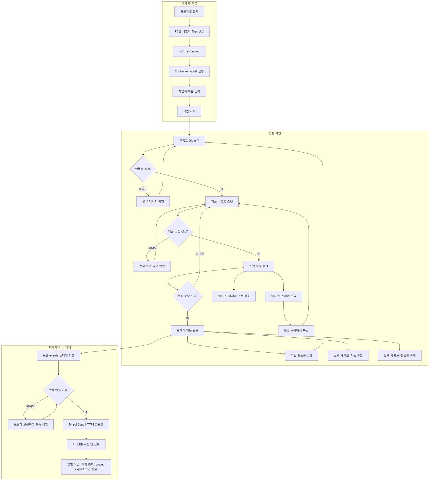
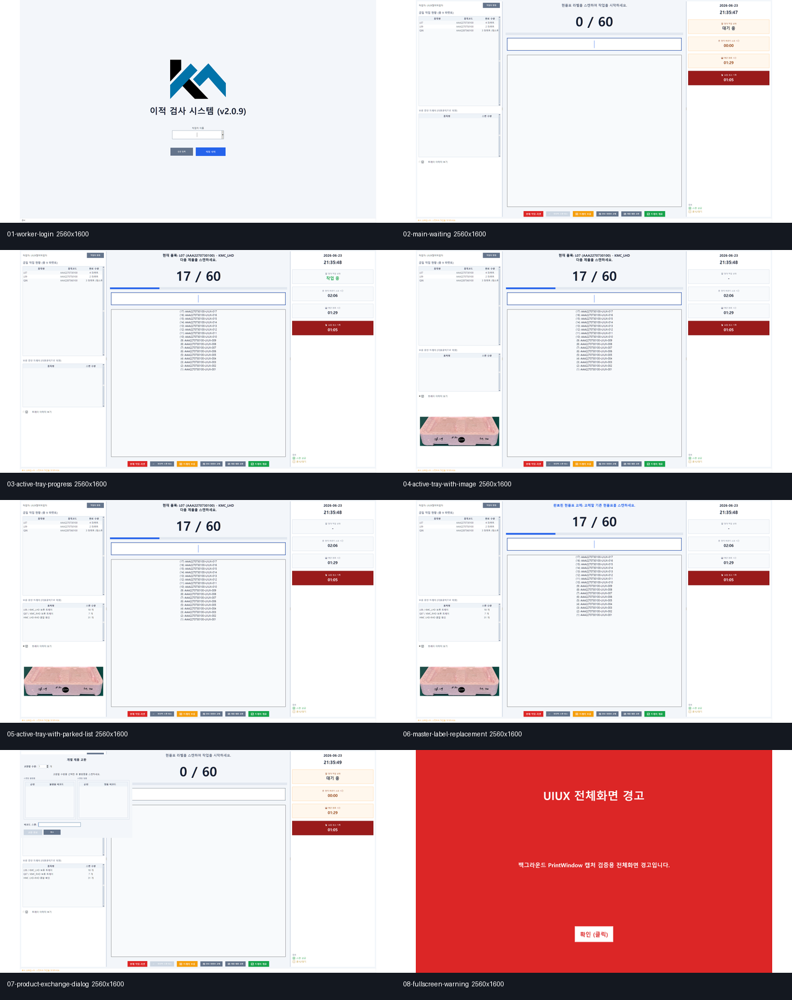
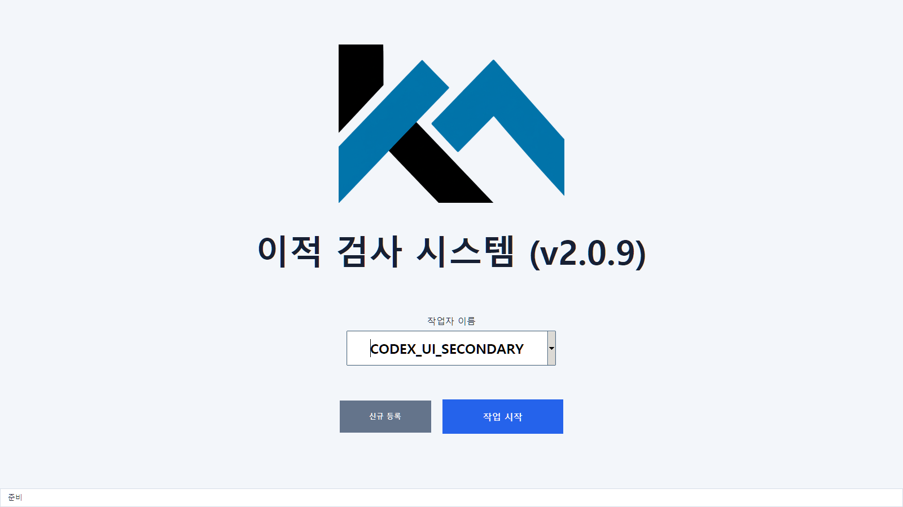
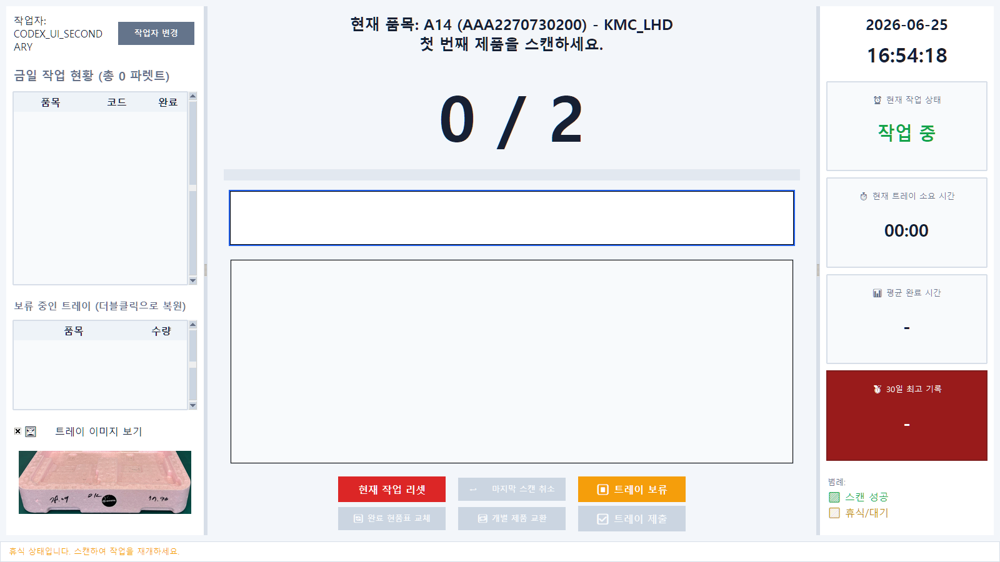
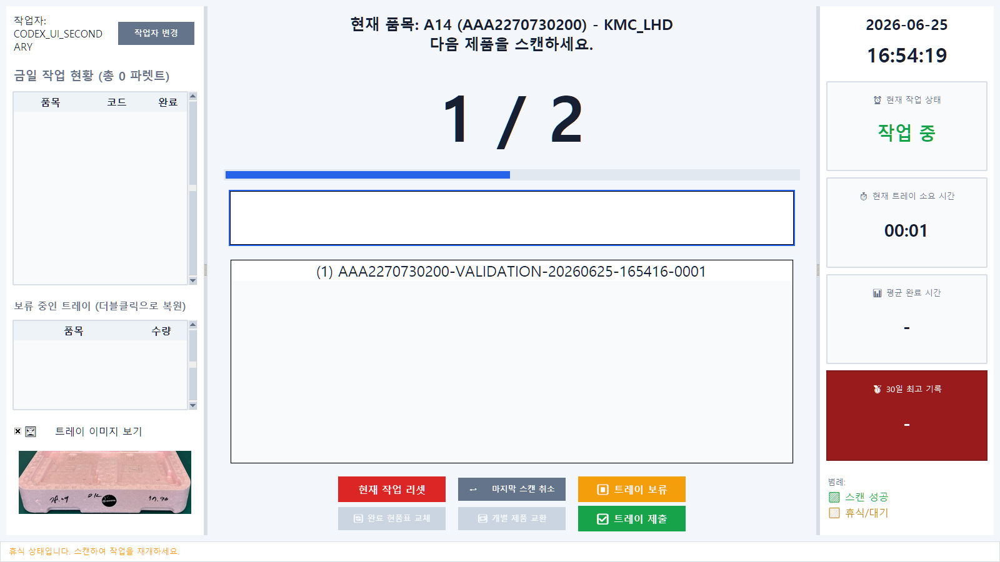
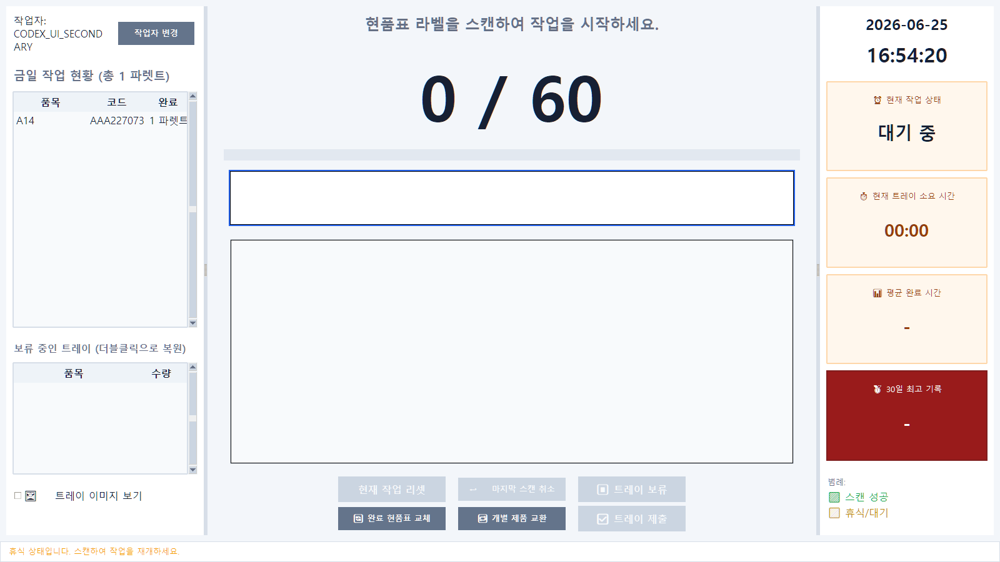
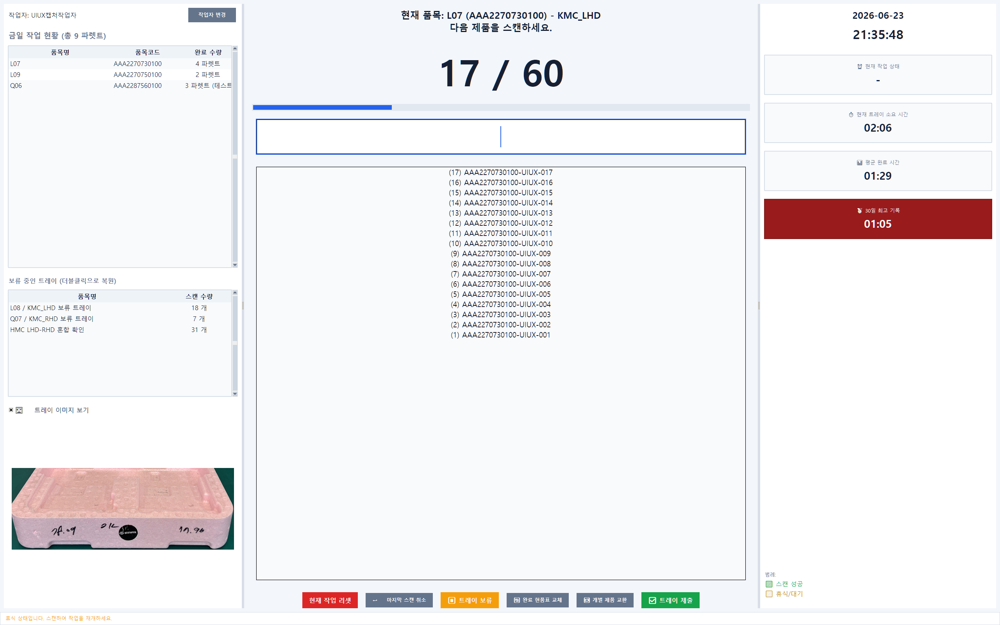
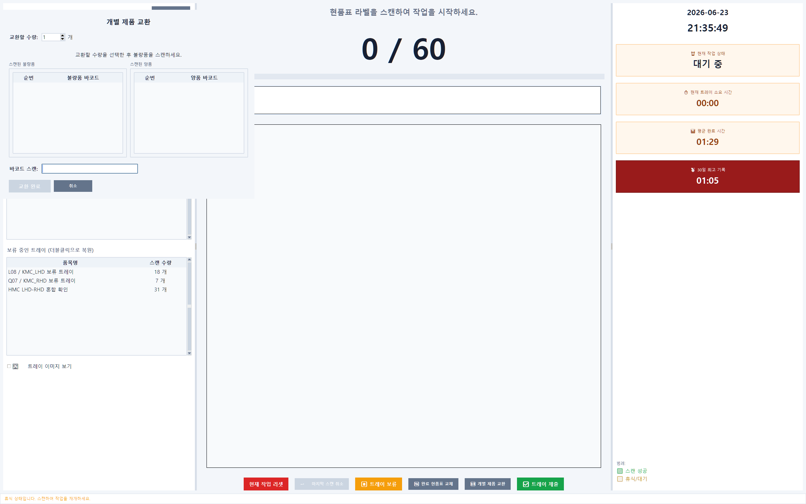
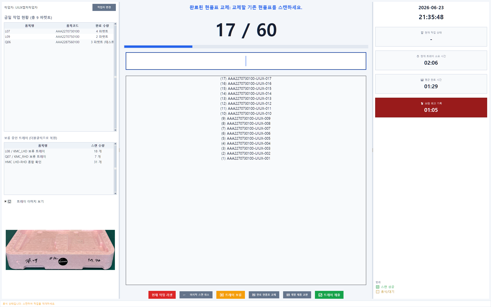
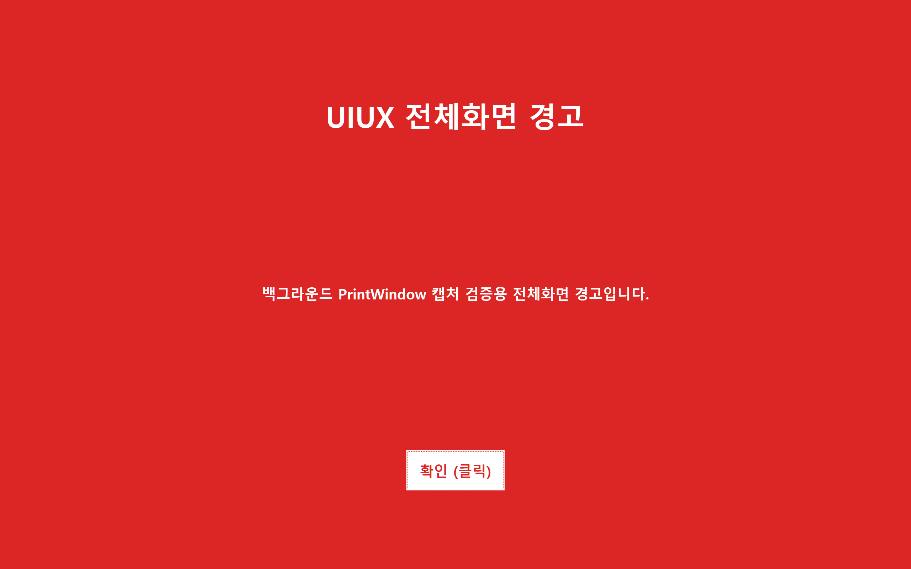

# 이적실 프로그램 사용 설명서

대상 프로그램: `Container_Audit`

대상 사용자: 이적실 현장 작업자, 작업 리더, 비전문가 사용자

작성 기준일: 2026-06-26

> 최신 문서는 `OUTLINE_CONTAINER_AUDIT_USER_MANUAL_20260627.md`입니다. 2026-06-30 검증 기준은 packaged 실행 파일을 DISPLAY2 전체화면에서 보류/복원까지 확인한 버전이며, Syncthing은 사용하지 않습니다.

이 문서는 OUTLINE에 올려서 현장 작업자가 그대로 따라 볼 수 있도록 만든 사용 설명서입니다. 어려운 서버, DB, 동기화 용어보다 실제 화면에서 무엇을 보고 무엇을 해야 하는지 중심으로 설명합니다.

## 전체 워크플로우

Mermaid 원본은 `docs/assets/container_audit_user_manual_20260626/00-workflow.mmd`에 보관합니다.

## 1. 꼭 기억할 것

이 프로그램은 이적실에서 현품표와 제품 바코드를 스캔해서 작업 기록을 남기는 프로그램입니다.

기본 작업 순서는 항상 같습니다.

1. 프로그램을 실행합니다.
2. 작업자 이름을 입력하고 작업을 시작합니다.
3. 현품표 QR코드를 먼저 스캔합니다.
4. 제품 바코드를 하나씩 스캔합니다.
5. 목표 수량을 채우면 트레이가 자동 완료됩니다.
6. 다음 현품표를 스캔합니다.

작업 데이터는 먼저 이 PC의 로컬 저장소에 저장됩니다. 그래서 인터넷이 잠시 끊겨도 당일 작업은 계속할 수 있습니다. 서버 연결이 가능해지면 Direct Sync가 서버로 업로드합니다. 배포 버전은 공유/동기화 폴더에 의존하지 않는 것을 기준으로 합니다.

작업자가 직접 수정하면 안 되는 것:

- 이벤트 CSV 파일
- 프로그램 폴더 안의 설정 파일
- Direct Sync 관련 credential, manifest, status 파일
- `%LOCALAPPDATA%\KMTech\ContainerAudit` 아래의 저장 파일

문제가 있으면 프로그램 안에서 다시 시도하거나 담당자에게 말해야 합니다. 파일을 직접 고치거나 삭제하면 서버 집계가 틀어질 수 있습니다.

## 2. 프로그램 실행 전 확인

아래 이미지는 이 설명서에서 다루는 주요 화면을 한 번에 모아 본 것입니다.

작업 시작 전 다음만 확인하면 됩니다.

- 바코드 스캐너가 PC에 연결되어 있는지 확인합니다.
- 스캐너로 메모장에 아무 바코드를 찍었을 때 글자가 입력되는지 확인합니다.
- 프로그램 폴더에서 `Container_Audit.exe`를 실행합니다.
- 스캐너는 보통 키보드처럼 동작합니다. 스캔할 때 마우스로 입력칸을 여러 번 누를 필요는 없습니다.

스캐너가 입력되지 않으면:

1. USB가 빠져 있는지 확인합니다.
2. 메모장에 스캔해 봅니다.
3. 메모장에도 안 찍히면 스캐너나 USB 연결 문제입니다.
4. 메모장에는 찍히는데 프로그램에 안 들어가면 프로그램 창을 한 번 클릭한 뒤 다시 스캔합니다.

## 3. 로그인 화면

처음 프로그램을 열면 작업자 이름을 입력하는 화면이 나옵니다.

해야 할 일:

1. `작업자 이름` 칸에 본인 이름을 입력합니다.
2. 기존 작업자라면 이름을 선택하거나 직접 입력합니다.
3. `작업 시작` 버튼을 누릅니다.

처음 쓰는 작업자라면:

- `신규 등록` 버튼을 누릅니다.
- 등록할 작업자 이름을 입력합니다.
- 등록 후 다시 `작업 시작`을 누릅니다.

주의:

- 작업자 이름은 작업 기록에 그대로 남습니다.
- 다른 사람 이름으로 작업하면 나중에 당일 작업량과 추적 기록이 틀어집니다.
- 이름 앞에 `=`, `+`, `-`, `@` 같은 문자를 넣으면 보안상 막힐 수 있습니다.

## 4. 작업 시작 직후 화면

작업 시작 후에는 크게 세 영역을 보면 됩니다.

왼쪽:

- 작업자 이름
- 누적 작업 현황
- 금일 작업 현황
- 보류 중인 트레이 목록

가운데:

- 현재 품목 정보
- 스캔 입력 상태
- 제품 스캔 목록
- 주요 작업 버튼

오른쪽:

- 현재 작업 상태
- 현재 트레이 소요 시간
- 평균 완료 시간
- 30일 최고 기록
- 색상 범례

이 화면에서 처음 해야 할 일은 현품표 QR코드를 스캔하는 것입니다.

## 5. 현품표 QR코드 스캔

현품표는 트레이 작업의 시작 기준입니다. 제품 바코드보다 먼저 현품표 QR코드를 스캔해야 합니다.

정상일 때 화면 변화:

- 가운데에 품목명, 품목코드, 목표 수량이 표시됩니다.
- 카운트가 `0 / 목표수량` 형태로 보입니다.
- 제품 바코드를 받을 준비가 됩니다.

현품표 스캔 시 자주 나오는 문제:

- `QR코드 오류`: 현품표 QR에 필요한 정보가 빠졌을 수 있습니다.
- `QR코드 분석 오류`: QR 형식이 프로그램이 아는 형식과 다를 수 있습니다.
- `현품표 중복`: 이미 완료된 현품표를 다시 스캔한 경우입니다.
- `보류 작업 발견`: 전에 보류해 둔 같은 현품표가 있는 경우입니다.

보류 작업 발견 창이 나오면:

- 이어서 작업할 것이 맞으면 `예`를 누릅니다.
- 새 작업을 하려던 것이면 담당자에게 확인합니다.

## 6. 제품 바코드 스캔

현품표가 정상으로 들어가면 제품 바코드를 하나씩 스캔합니다.

정상일 때:

- 성공음이 납니다.
- 스캔 목록에 제품 바코드가 추가됩니다.
- 카운트가 올라갑니다.
- 진행 막대가 채워집니다.

예시:

- 목표 수량이 2개이면 첫 번째 제품 스캔 후 `1 / 2`가 됩니다.
- 두 번째 제품까지 스캔하면 자동으로 완료됩니다.

제품 스캔 중 주의:

- 같은 제품을 두 번 찍으면 중복으로 막힐 수 있습니다.
- 현품표 품목과 맞지 않는 제품을 찍으면 오류가 납니다.
- 제품 바코드가 너무 짧거나 형식이 맞지 않으면 오류가 납니다.

오류가 크게 뜨면:

1. 화면의 메시지를 읽습니다.
2. `확인 (클릭)` 버튼을 누릅니다.
3. 잘못 스캔한 제품인지, 현품표가 맞는지 확인합니다.
4. 맞는 바코드를 다시 스캔합니다.

## 7. 목표 수량 완료

목표 수량만큼 스캔하면 프로그램이 트레이를 완료 처리합니다.

정상 완료 시:

- 완료 메시지가 상태 영역에 표시됩니다.
- 금일 작업 현황에 완료 수량이 반영됩니다.
- 현재 작업 화면이 다음 현품표를 받을 준비 상태로 돌아갑니다.

작업자가 따로 저장 버튼을 누르지 않아도 됩니다. 완료 이벤트와 스캔 내역은 자동으로 로컬 이벤트 파일에 기록됩니다.

## 8. 주요 버튼 설명

아래 버튼들은 작업 화면 가운데 아래쪽에 있습니다.

`현재 작업 리셋`

- 지금 진행 중인 트레이의 스캔 기록을 초기화합니다.
- 현품표를 잘못 시작했거나 처음부터 다시 해야 할 때만 사용합니다.
- 누르면 확인창이 뜹니다.
- 이미 스캔한 내용이 사라질 수 있으므로 혼자 판단하기 어렵다면 담당자에게 확인합니다.

`↩️ 마지막 스캔 취소`

- 방금 찍은 마지막 제품 바코드 1개만 취소합니다.
- 실수로 같은 제품을 잘못 찍었거나 다른 제품을 찍었을 때 사용합니다.
- 여러 개를 한꺼번에 취소하는 버튼이 아닙니다.

`⏸️ 트레이 보류`

- 지금 작업하던 트레이를 잠시 보류합니다.
- 다른 현품표를 먼저 처리해야 할 때 사용합니다.
- 보류한 작업은 왼쪽 `보류 중인 트레이` 목록에 표시됩니다.

보류 작업 다시 불러오기:

1. 왼쪽 `보류 중인 트레이` 목록을 봅니다.
2. 다시 할 트레이를 더블클릭합니다.
3. 확인창이 나오면 내용을 읽고 선택합니다.

`🔄 완료 현품표 교체`

- 이미 완료된 작업의 현품표를 교체해야 할 때 사용합니다.
- 일반 작업 중에는 거의 쓰지 않습니다.
- 진행 중인 트레이가 있을 때는 사용할 수 없습니다.
- 담당자 지시가 있을 때만 사용합니다.

`🔁 개별 제품 교환`

- 완료된 작업 후 특정 불량품을 양품으로 교환할 때 사용합니다.
- 진행 중인 트레이가 있으면 먼저 제출하거나 완료해야 합니다.
- 교환할 수량을 선택하고 불량품을 먼저 스캔한 뒤 양품을 스캔합니다.

`✅ 트레이 제출`

- 목표 수량을 다 채우지 않았지만 현재 스캔한 수량으로 트레이를 완료 처리할 때 사용합니다.
- 부분 트레이 제출이 필요한 상황에서만 사용합니다.
- 누르면 `현재 n개 스캔되었습니다. 이 트레이를 완료로 처리하시겠습니까?`라는 확인창이 나옵니다.

## 9. 개별 제품 교환

개별 제품 교환은 완료된 작업에서 나중에 불량품이 발견되어 양품과 바꿀 때 쓰는 기능입니다.

진행 순서:

1. 진행 중인 트레이가 없는 상태인지 확인합니다.
2. `🔁 개별 제품 교환` 버튼을 누릅니다.
3. 교환할 수량을 선택합니다.
4. 불량품 바코드를 먼저 스캔합니다.
5. 프로그램이 `불량품 스캔 완료. 이제 양품을 스캔하세요.`라고 안내하면 양품 바코드를 스캔합니다.
6. 수량만큼 모두 스캔하면 `교환 완료` 버튼이 활성화됩니다.
7. `교환 완료`를 누릅니다.

주의:

- 불량품과 양품의 순서를 바꾸면 안 됩니다.
- 교환 수량을 먼저 맞춰야 합니다.
- 완료 버튼이 비활성화되어 있으면 아직 필요한 스캔이 끝나지 않은 것입니다.

## 10. 완료 현품표 교체

현품표 교체는 이미 끝난 작업의 현품표 정보가 잘못되었을 때 쓰는 보정 기능입니다.

일반 작업자는 담당자 지시 없이 사용하지 않는 것이 원칙입니다.

진행 순서:

1. 진행 중인 트레이가 없어야 합니다.
2. `🔄 완료 현품표 교체` 버튼을 누릅니다.
3. 교체할 기존 현품표를 스캔합니다.
4. 적용할 새 현품표를 스캔합니다.
5. 필요한 제품 바코드를 확인합니다.
6. 완료 안내가 나오면 담당자와 확인합니다.

프로그램은 교체 내용을 기존 기록을 지우는 방식이 아니라 correction 이벤트로 추가 기록합니다. 그래서 임의로 CSV를 수정하면 안 됩니다.

## 11. 종료와 복구

프로그램을 닫을 때 진행 중인 트레이가 있으면 저장 여부를 묻습니다.

권장:

- 작업을 이어서 해야 하면 저장하고 종료합니다.
- 완전히 잘못 시작한 작업이면 담당자 확인 후 저장하지 않고 종료할 수 있습니다.

다음 실행 때 복구창이 나올 수 있습니다.

복구창 예시:

- `이전에 마치지 못한 트레이 작업을 이어서 시작하시겠습니까?`
- `이전 작업자 '이름'님이 마치지 않은 작업이 있습니다. 이 작업을 이어서 진행하시겠습니까?`

선택 기준:

- 본인이 하던 작업이고 이어서 해야 하면 `예`
- 다른 사람이 하던 작업이면 담당자에게 확인
- 확실히 필요 없는 작업이면 삭제할 수 있지만, 삭제 전 담당자 확인 권장

## 12. 작업자 변경

왼쪽 위의 `작업자 변경` 버튼은 같은 PC에서 다른 작업자가 이어서 사용할 때 누릅니다.

진행 중인 작업이 있으면:

- 프로그램이 작업을 저장하거나 중지 기록을 남길 수 있습니다.
- 오류가 나면 작업자를 바꾸지 말고 담당자에게 알립니다.

주의:

- 프로그램을 강제로 끄기보다 `작업자 변경`이나 정상 종료를 사용하는 것이 좋습니다.

## 13. 화면 크기 조절

글씨가 너무 크거나 작으면:

- 키보드 `Ctrl` 키를 누른 상태에서 마우스 휠을 위아래로 움직입니다.

프로그램은 화면 배율 설정을 저장합니다. 다음 실행 때도 비슷한 크기로 열릴 수 있습니다.

## 14. 당일 작업 현황 보기

왼쪽의 `금일 작업 현황` 또는 `누적 작업 현황`에서 오늘 완료한 품목과 수량을 볼 수 있습니다.

작업 완료 후 수량이 바로 올라가면 정상입니다.

수량이 예상과 다르면:

1. 지금 막 완료한 트레이가 맞는지 확인합니다.
2. 작업자 이름이 맞는지 확인합니다.
3. 현품표가 중복 처리되지 않았는지 확인합니다.
4. 담당자에게 알려 서버 집계 화면과 비교합니다.

## 15. 로컬 저장과 서버 업로드

작업자는 서버 구조를 알 필요는 없지만, 아래 원칙은 알아두면 좋습니다.

작업 기록 저장 방식:

1. 스캔 기록은 먼저 이 PC의 로컬 저장소에 저장됩니다.
2. Direct Sync가 백그라운드에서 서버로 업로드합니다.
3. 서버 연결이 잠시 끊겨도 로컬 기록은 남습니다.
4. 인터넷이 복구되면 업로드가 다시 진행됩니다.

작업자가 하지 말아야 할 것:

- 공유/동기화 폴더로 파일 직접 옮기기
- CSV 파일을 직접 열어서 수정하기
- `direct_sync` 폴더의 파일 삭제하기
- credential 파일을 복사하거나 공유하기

배포 버전의 기준:

- 공유/동기화 폴더가 없어도 작업 가능
- 최근 며칠 기록은 로컬에 남음
- 주된 저장/집계는 서버에서 처리
- 설치하면 PC별 식별자가 자동 생성되어 작업 가능
- 설치 후 작업자가 별도 토큰을 입력하거나 승인 요청할 필요 없음

## 16. 상태와 오류 메시지 대응

`입력 모드 오류`

- 한글 입력 상태에서 스캔 문자가 들어온 경우입니다.
- 키보드 `한/영` 키를 눌러 영어 입력 상태로 바꾼 뒤 다시 스캔합니다.

`바코드 형식 오류`

- 제품 바코드가 너무 짧거나 형식이 맞지 않습니다.
- 제품 바코드인지 현품표인지 다시 확인합니다.

`현품표 중복`

- 이미 완료된 현품표입니다.
- 새 현품표가 맞는지 확인합니다.

`보류 작업 중복`

- 같은 현품표가 보류 목록에 있습니다.
- 보류 작업을 복원할지 담당자와 확인합니다.

`트레이 수량 초과`

- 목표 수량이 이미 찼는데 더 스캔하려고 한 경우입니다.
- 먼저 완료 처리가 되었는지 확인합니다.

`작업 기록 실패` 또는 `로그 파일 쓰기 오류`

- 기록 저장에 문제가 생긴 상황입니다.
- 프로그램을 끄거나 파일을 만지지 말고 담당자에게 바로 알립니다.

## 17. 테스트 화면 또는 내부 로그

이 화면은 검증 과정에서 만든 내부 테스트 로그 화면입니다. 실제 현장 작업자는 보통 이 기능을 쓰지 않습니다.

운영 중에는 다음만 기억하면 됩니다.

- 테스트 명령어를 임의로 입력하지 않습니다.
- 작업자 교육이나 관리자 검증 때만 담당자 지시에 따라 사용합니다.
- 배포 버전에서는 내부 테스트 기능이 꺼져 있을 수 있습니다.

## 18. 작업 완료 후 대기 화면

트레이가 완료되면 프로그램은 다음 현품표를 받을 수 있는 상태로 돌아갑니다.

정상 대기 상태:

- 현재 작업 카운트가 초기화됩니다.
- 이전 완료 수량은 왼쪽 현황에 반영됩니다.
- 가운데는 다음 현품표를 기다립니다.

다음 작업을 시작하려면 새 현품표 QR코드를 스캔하면 됩니다.

## 19. 좋은 작업 습관

- 현품표를 먼저 스캔하고 제품을 스캔합니다.
- 오류가 나오면 메시지를 읽고 `확인` 후 다시 시도합니다.
- 잘못 찍었다고 생각되면 바로 `마지막 스캔 취소`를 사용합니다.
- 다른 작업을 급히 해야 하면 `트레이 보류`를 사용합니다.
- 프로그램 폴더나 저장 폴더의 파일은 직접 수정하지 않습니다.
- 작업자 이름을 정확히 입력합니다.
- 문제가 반복되면 화면 사진을 찍거나 오류 문구를 적어 담당자에게 전달합니다.

## 20. 담당자에게 알려야 하는 상황

아래 상황은 현장 작업자가 혼자 해결하려고 하지 말고 담당자에게 알려야 합니다.

- 같은 현품표가 계속 중복으로 나온다.
- 정상 제품인데 계속 품목 불일치가 난다.
- 작업 완료 후 금일 현황 수량이 이상하다.
- 프로그램이 `작업 기록 실패`, `로그 파일 쓰기 오류`를 보여준다.
- PC를 바꿨는데 이전 작업 복구창이 나온다.
- Direct Sync 상태가 계속 실패라고 나온다.
- 서버 화면의 당일 작업과 PC 화면 수량이 다르다.
- 프로그램 업데이트 실패가 나온다.

## 21. 관리자용 짧은 확인표

현장 배포 후 관리자는 다음을 확인합니다.

- 작업자 PC에서 프로그램 실행 가능
- 신규 작업자 등록 가능
- 현품표 스캔 가능
- 제품 스캔 가능
- 목표 수량 자동 완료 가능
- 마지막 스캔 취소 가능
- 현재 작업 리셋 가능
- 트레이 보류 및 복원 가능
- 개별 제품 교환 가능
- 완료 현품표 교체 가능
- 종료 후 복구 가능
- 로컬 events 폴더에 CSV 생성
- Direct Sync 상태 `idle` 또는 정상 업로드
- 서버 당일 조회에 완료 기록 반영
- 서버 과거 조회/trace/export에서 누락 없음

## 22. OUTLINE 게시 메모

이 문서는 OUTLINE 게시용 Markdown 원본입니다.

게시 결과:

- OUTLINE 부모 문서: `https://wiki.kmtecherp.com/doc/8jsuydsp4hsgrag7zse66gc6re4656o-7EK8SbJ618`
- OUTLINE 문서: `https://wiki.kmtecherp.com/doc/container_audit-aJEkn1X2yH`
- OUTLINE document id: `38dcd747-21d1-456f-852d-c929aa835e03`
- 게시 시각: 2026-06-26 KST
- 게시 방식: 서버 `/root/.outline_env`의 승인된 Outline API 환경을 사용해 문서 생성 후 기존 이미지 12장을 document attachment로 업로드하고 본문 이미지 링크를 `/api/attachments.redirect` URL로 치환했다.
- 2026-06-27 로컬 원본에는 전체 워크플로우 이미지 1장을 추가했다. OUTLINE 게시본에 반영하려면 `00-workflow.png`를 추가 attachment로 올리고 상단 이미지를 attachment URL로 치환해야 한다.

이미지 자산:

- `docs/assets/container_audit_user_manual_20260626/00-workflow.png`
- `docs/assets/container_audit_user_manual_20260626/00-workflow.svg`
- `docs/assets/container_audit_user_manual_20260626/00-workflow.mmd`
- `docs/assets/container_audit_user_manual_20260626/01-login.png`
- `docs/assets/container_audit_user_manual_20260626/02-work-start.png`
- `docs/assets/container_audit_user_manual_20260626/03-master-label.png`
- `docs/assets/container_audit_user_manual_20260626/04-product-scan-1.png`
- `docs/assets/container_audit_user_manual_20260626/05-product-scan-2.png`
- `docs/assets/container_audit_user_manual_20260626/06-internal-test-log.png`
- `docs/assets/container_audit_user_manual_20260626/07-final-state.png`
- `docs/assets/container_audit_user_manual_20260626/08-contact-sheet.png`
- `docs/assets/container_audit_user_manual_20260626/09-parked-tray-list.png`
- `docs/assets/container_audit_user_manual_20260626/10-master-label-replacement.png`
- `docs/assets/container_audit_user_manual_20260626/11-product-exchange-dialog.png`
- `docs/assets/container_audit_user_manual_20260626/12-fullscreen-warning.png`

원본 검증 evidence:

- `C:\company\program\Container_Audit\.tmp\ui-validation-secondary-20260625-165416\ui_validation_report.json`
- `C:\company\program\Container_Audit\.tmp\ui-validation-secondary-20260625-165416\screenshots`
- `C:\company\program\.deploy_backups\Container_Audit_local_state_20260625-124732\.codex\uiux-captures\20260623-213546-full-uiux-background`

OUTLINE에 올릴 때는 Markdown 본문을 붙여 넣은 뒤 워크플로우 이미지를 포함한 PNG 13장을 같은 순서로 첨부하거나, OUTLINE import가 로컬 상대 이미지 링크를 지원하는 방식이면 `docs/assets/container_audit_user_manual_20260626` 폴더를 함께 사용합니다.
