# 이적실 프로그램 사용 설명서

대상 프로그램: `Container_Audit`

대상 사용자: 이적실 현장 작업자, 작업 리더, 비전문가 사용자

작성 기준일: 2026-06-30
문서 개정일: 2026-06-30
파일 최초 작성일: 2026-06-27

검증 기준: 실제 패키징 실행 파일을 Windows DISPLAY2 전체화면에 띄우고, 작업자 PC처럼 마우스/키보드 입력으로 검증한 화면을 사용했습니다. 테스트 명령, 내부 자동 테스트 코드, 운영 DB 직접 수정은 사용하지 않았습니다.

2026-06-30 최신 검증 반영:

- 보류/복원 실제 packaged workflow를 재검증했습니다.
- 증거 위치: `C:\company\program\_e2e_artifacts\container_audit_packaged_display2_parkfix2_20260630_0115`
- OUTLINE 이미지 자산: `docs/assets/container_audit_user_manual_20260630_annotated`
- 결과: `status=PASS`
- 실제 CSV 이벤트: `WORK_START=1`, `MASTER_LABEL_SCANNED_NEW=1`, `SCAN_OK=2`, `TRAY_PARKED=1`, `TRAY_RESTORED_FROM_PARK=1`, `TRAY_COMPLETE=1`
- 깊은 패키지 경로에서도 보류 트레이 파일이 저장되도록 보류 파일명 길이를 줄였습니다.
- 화면별 요소 강조 박스를 추가했고, 예전 경고 화면에 남아 있던 검은 캡처 여백을 보정했습니다.
- Syncthing은 사용하지 않습니다. 작업 기록은 로컬 저장 후 직접 전송 경로에서 취합합니다.

캡처의 품명, 수량, 바코드, 작업자 이름은 예시입니다. 실제 작업에서는 현재 화면과 실물 기준을 따릅니다.

처음 1건 처리 빠른 시작:

1. 작업자 이름을 입력하고 `작업 시작`을 누릅니다.
2. 현품표 QR을 먼저 스캔합니다.
3. 화면의 현품표 번호, 품목명, 품목 코드, 목표 수량이 실물 현품표와 같은지 확인합니다.
4. 제품 바코드 1개를 스캔하고 수량이 1개 올라갔는지 봅니다.
5. 빨간 경고가 나오면 다음 제품을 찍지 말고 담당자에게 화면을 보여줍니다.

보류/복원 빠른 시작:

1. 현품표를 스캔하고 제품 일부를 스캔합니다.
2. 다른 현품표를 먼저 처리해야 하면 `트레이 보류`를 누릅니다.
3. 같은 현품표를 다시 스캔합니다.
4. 복원 확인창에서 작업이 맞는지 확인하고 `예`를 누릅니다.
5. 남은 제품을 스캔해 목표 수량을 채우면 자동 완료됩니다.

용어 정리:

| 용어 | 뜻 |
|---|---|
| 현품표 QR | 이적 작업을 시작할 때 먼저 스캔하는 기준 QR |
| 제품 바코드 | 현품표 기준에 맞는 제품을 하나씩 확인하는 개별 바코드 |
| 트레이 | 현품표 하나로 묶어서 처리하는 작업 단위 |
| 보류 | 진행 중인 트레이를 잠시 멈추고 나중에 같은 현품표로 이어가는 기능 |
| 복원 | 보류하거나 종료 전에 저장한 작업을 다시 불러오는 기능 |
| 부분 제출 | 목표 수량이 모자란 상태를 담당자 지시로 마감하는 예외 기능 |
| 전송 대기 | 기록은 PC에 저장됐고 서버 전송을 기다리는 상태 |

## 전체 워크플로우

아래 이미지는 전체 흐름을 한 장으로 정리한 것입니다. OUTLINE에서 Mermaid가 코드처럼 보이면 PNG 이미지와 단계 표를 기준으로 보면 됩니다.

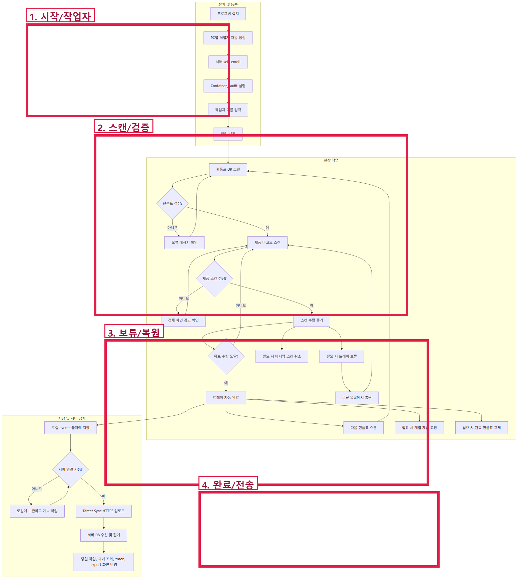

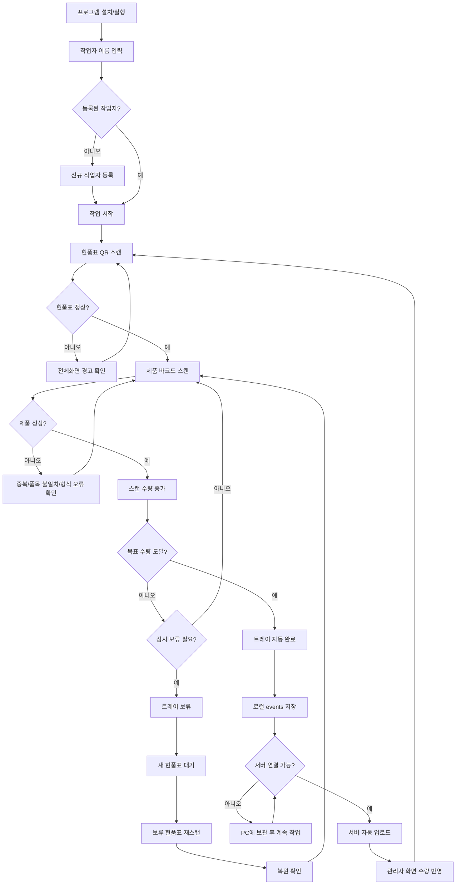
```mermaid
flowchart TD
  A["프로그램 설치/실행"] --> B["작업자 이름 입력"]
  B --> C{"등록된 작업자?"}
  C -- "아니오" --> C1["신규 작업자 등록"]
  C1 --> D["작업 시작"]
  C -- "예" --> D
  D --> E["현품표 QR 스캔"]
  E --> F{"현품표 정상?"}
  F -- "아니오" --> F1["전체화면 경고 확인"]
  F1 --> E
  F -- "예" --> G["제품 바코드 스캔"]
  G --> H{"제품 정상?"}
  H -- "아니오" --> H1["중복/품목 불일치/형식 오류 확인"]
  H1 --> G
  H -- "예" --> I["스캔 수량 증가"]
  I --> J{"목표 수량 도달?"}
  J -- "아니오" --> B1{"잠시 보류 필요?"}
  B1 -- "예" --> B2["트레이 보류"]
  B2 --> B3["새 현품표 대기"]
  B3 --> B4["보류 현품표 재스캔"]
  B4 --> B5["복원 확인"]
  B5 --> G
  B1 -- "아니오" --> G
  J -- "예" --> K["트레이 자동 완료"]
  K --> L["로컬 events 저장"]
  L --> M{"서버 연결 가능?"}
  M -- "아니오" --> M1["PC에 보관 후 계속 작업"]
  M1 --> M
  M -- "예" --> N["서버 자동 업로드"]
  N --> O["관리자 화면 수량 반영"]
  O --> E
```

## 1. 꼭 기억할 것

이 프로그램은 현품표 QR과 제품 바코드를 스캔해서 작업 기록을 남기는 프로그램입니다.

기본 순서는 항상 같습니다.

1. 프로그램을 실행합니다.
2. 작업자 이름을 입력합니다.
3. 작업 시작을 누릅니다.
4. 현품표 QR을 먼저 스캔합니다.
5. 제품 바코드를 하나씩 스캔합니다.
6. 목표 수량을 채우면 자동으로 완료됩니다.
7. 다음 현품표를 스캔합니다.

작업 데이터는 먼저 이 PC의 로컬 저장소에 저장됩니다. 인터넷이 잠시 끊겨도 당일 작업은 계속할 수 있어야 합니다. 서버 연결이 가능하면 프로그램이 서버로 자동 업로드합니다. 배포 버전은 공유 폴더에 의존하지 않는 것을 기준으로 합니다.

작업자가 직접 고치면 안 되는 것:

- 이벤트 CSV 파일
- 프로그램 설정 파일
- 자동 저장/전송 관련 파일
- 로컬 저장소 안의 상태 파일

문제가 생기면 화면에서 안내되는 버튼으로 처리하거나 담당자에게 알려야 합니다.

## 2. 주요 화면 한눈에 보기

아래 이미지는 이 설명서에서 다루는 실제 검증 화면을 요소별 강조 박스와 함께 모아 둔 것입니다.

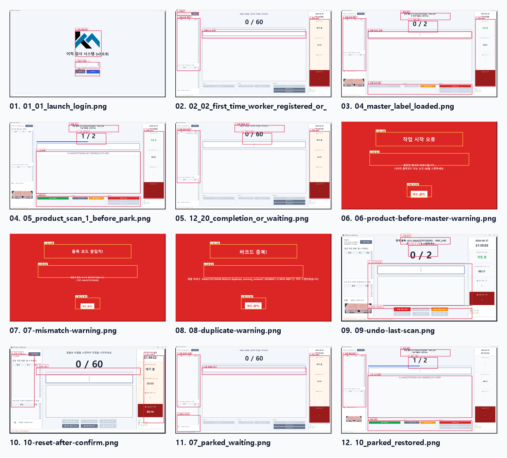

## 3. 로그인과 신규 작업자

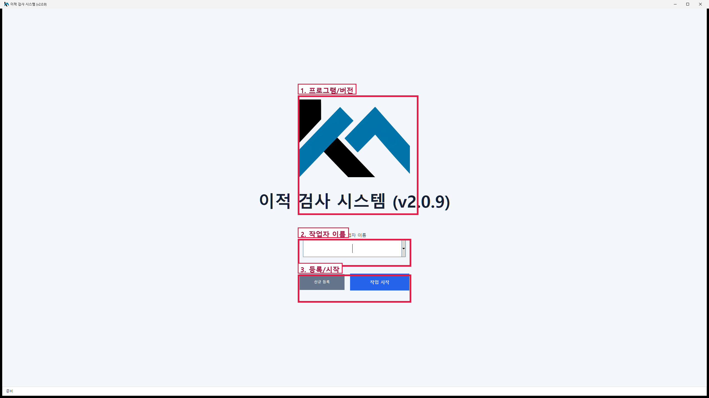

처음 실행하면 작업자 이름을 입력하는 화면이 나옵니다.

해야 할 일:

1. 작업자 이름 칸에 본인 이름을 입력합니다.
2. `작업 시작` 버튼을 누릅니다.
3. 처음 쓰는 이름이면 신규 작업자 등록 확인창이 뜹니다.
4. 이름 철자를 다시 확인한 뒤 본인 이름이 맞으면 `예`를 누릅니다.
5. 오타가 있으면 `아니오`를 누르고 이름을 다시 입력합니다.

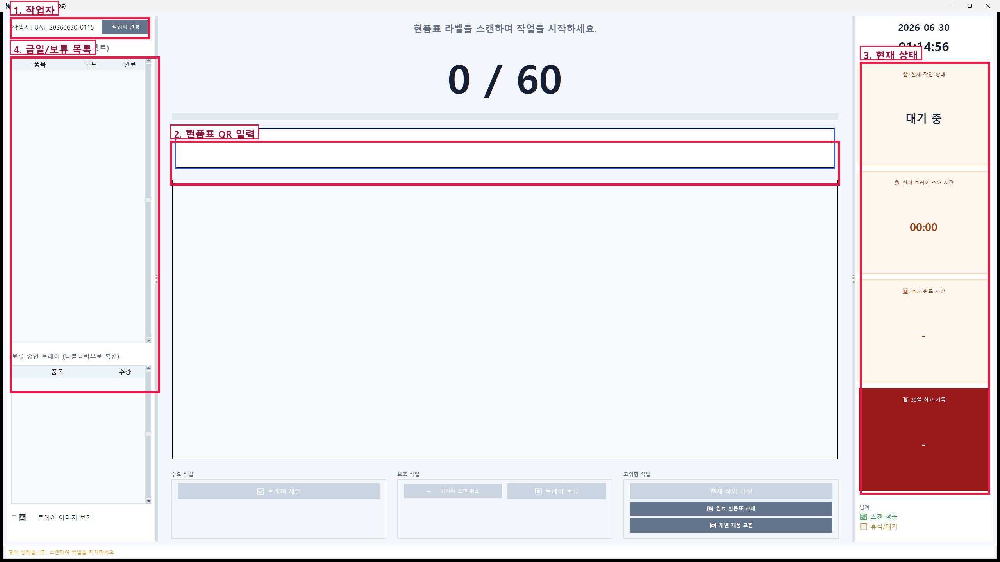

정상 시작이면 작업 화면으로 넘어가고, 화면 가운데에 현품표를 스캔하라는 안내가 보입니다.

신규 작업자 등록 확인 후 작업 화면입니다. 이 화면이 보이면 다음 행동은 제품 스캔이 아니라 현품표 QR 스캔입니다.

주의:

- 다른 사람 이름으로 작업하지 않습니다.
- 이름은 작업 기록과 서버 집계에 연결됩니다.
- 설치 후 별도 토큰 주입 없이 신규 작업자 등록 후 바로 작업되는 흐름은 실제 화면으로 검증했습니다.

## 4. 현품표 QR 스캔

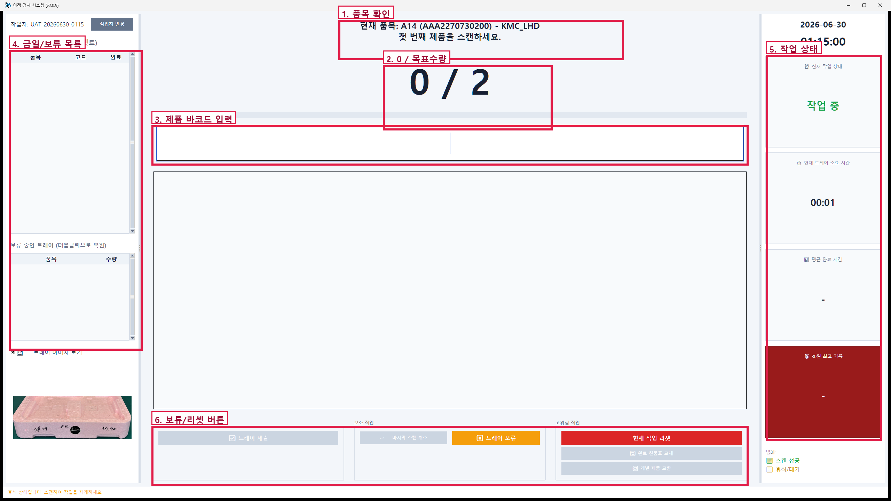

현품표는 작업의 시작 기준입니다. 제품 바코드보다 먼저 현품표 QR을 스캔해야 합니다.

정상일 때:

- 가운데에 현재 품목과 품목 코드가 표시됩니다.
- 수량이 `0 / 목표수량`으로 표시됩니다.
- 상태가 `작업 중`으로 바뀝니다.
- 제품 바코드를 받을 준비가 됩니다.

제품을 스캔하기 전에 화면의 현품표 번호, 품목명, 품목 코드, 목표 수량이 실제 현품표와 같은지 확인합니다. 하나라도 다르면 제품을 스캔하지 말고 담당자에게 알립니다.

현품표가 잘못되면 전체화면 경고가 뜹니다. 경고를 읽고 `확인`을 누른 뒤 올바른 현품표를 다시 스캔합니다.

## 5. 제품 바코드 스캔

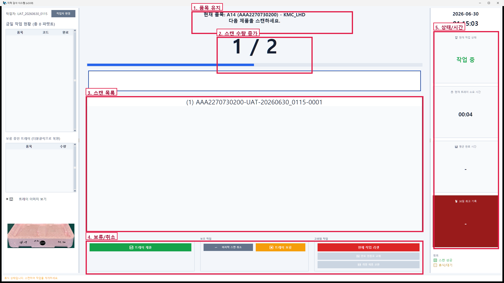

현품표가 정상으로 들어가면 제품 바코드를 하나씩 스캔합니다.

정상일 때:

- 스캔 목록에 제품이 추가됩니다.
- 수량이 올라갑니다.
- 진행 막대가 채워집니다.

목표 수량이 2개이면 첫 번째 제품 후 `1 / 2`, 두 번째 제품 후 자동 완료가 됩니다.

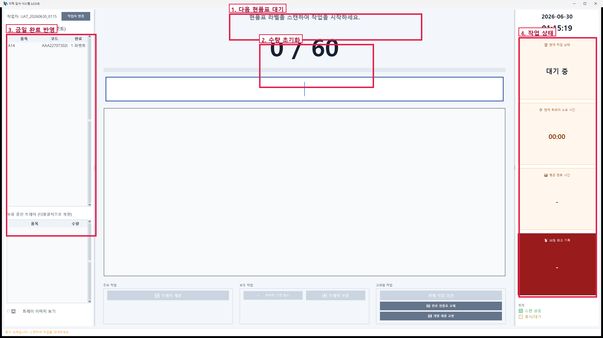

자동 완료 후 다음 현품표 대기 화면입니다. 이전 트레이는 저장되고 수량은 새 작업 기준으로 초기화됩니다. `0 / 목표수량`처럼 보여도 방금 완료한 작업이 사라진 것이 아닙니다.

완료되면 다음 현품표를 받을 수 있는 대기 상태로 돌아갑니다. 별도 저장 버튼을 누를 필요가 없습니다.

## 6. 자주 하는 실수와 경고

### 현품표 전에 제품을 먼저 스캔한 경우

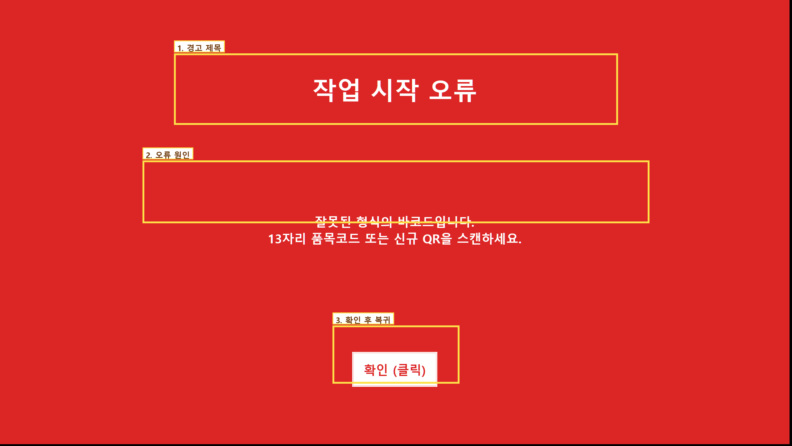

제품을 먼저 스캔하면 작업 시작 오류가 뜹니다.

처리 방법:

1. `확인`을 누릅니다.
2. 현품표 QR을 먼저 스캔합니다.
3. 제품 바코드를 다시 스캔합니다.

### 품목이 맞지 않는 제품을 스캔한 경우

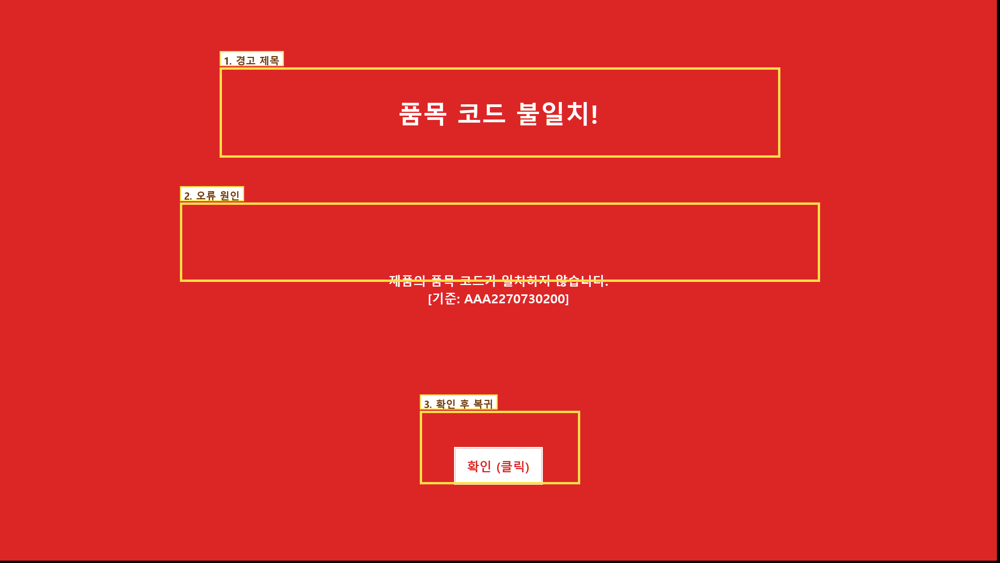

현품표 품목과 다른 제품을 찍으면 품목 불일치 경고가 뜹니다.

처리 방법:

1. `확인`을 누릅니다.
2. 현품표와 실제 제품이 같은 작업인지 확인합니다.
3. 맞는 제품 바코드를 다시 스캔합니다.

### 같은 제품을 두 번 스캔한 경우

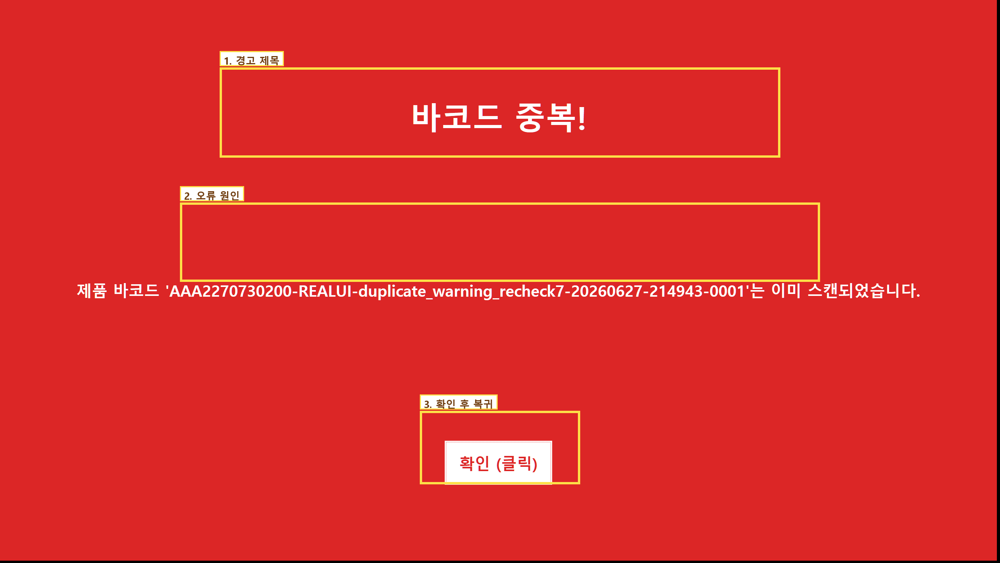

같은 제품 바코드를 다시 찍으면 중복 경고가 뜹니다.

처리 방법:

1. `확인`을 누릅니다.
2. 이미 스캔 목록에 들어간 제품인지 확인합니다.
3. 다음 제품을 스캔합니다.

## 7. 마지막 스캔 취소

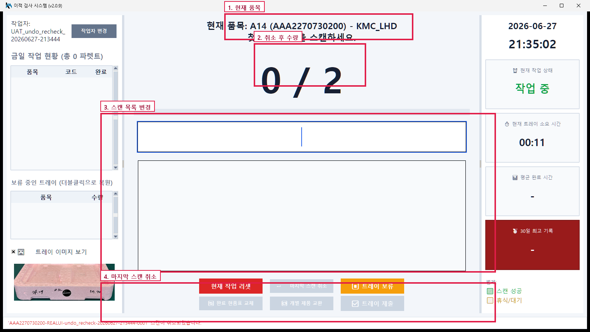

`마지막 스캔 취소`는 방금 찍은 제품 1개만 되돌립니다.

자동 완료 전 진행 중인 트레이에서만 사용합니다. 취소하면 스캔 목록에서 마지막 제품이 빠지고 수량이 1개 줄어듭니다.

사용할 때:

- 방금 잘못된 제품을 찍은 것을 바로 알았을 때
- 같은 제품을 잘못 처리했다고 판단했을 때

주의:

- 여러 개를 한꺼번에 되돌리는 기능이 아닙니다.
- 취소 후 올바른 제품을 다시 스캔해야 합니다.
- 마지막 제품이 확실하지 않으면 취소하지 말고 담당자에게 화면을 보여줍니다.

## 8. 현재 작업 리셋

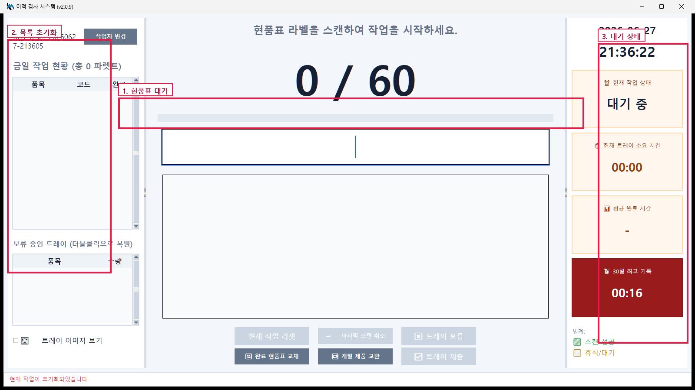

`현재 작업 리셋`은 진행 중인 트레이를 처음부터 다시 시작하는 기능입니다.

사용할 때:

- 현품표를 잘못 시작했을 때
- 현재 트레이의 스캔 기록을 모두 버리고 다시 시작해야 할 때

주의:

- 리셋을 확정하면 현재 트레이의 미완료 스캔 내역을 버리고 현품표 선택 전 상태로 돌아갑니다.
- 이미 완료된 트레이를 되돌리는 기능이 아닙니다.
- 혼자 판단하기 어렵다면 담당자에게 확인합니다.

## 9. 트레이 보류와 복원

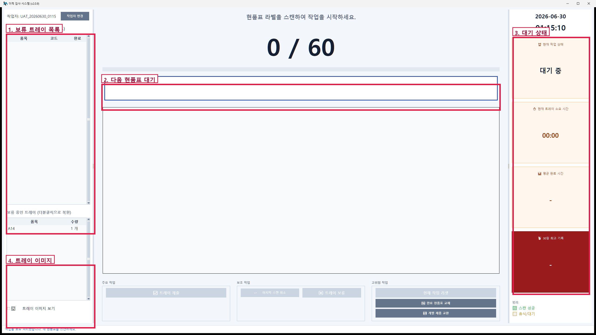

`트레이 보류`는 지금 작업 중인 트레이를 잠시 멈추고 다른 현품표를 처리할 때 사용합니다.

보류 후:

- 현재 화면은 새 현품표를 받을 준비 상태가 됩니다.
- 보류 중인 트레이는 왼쪽 목록에 남습니다.

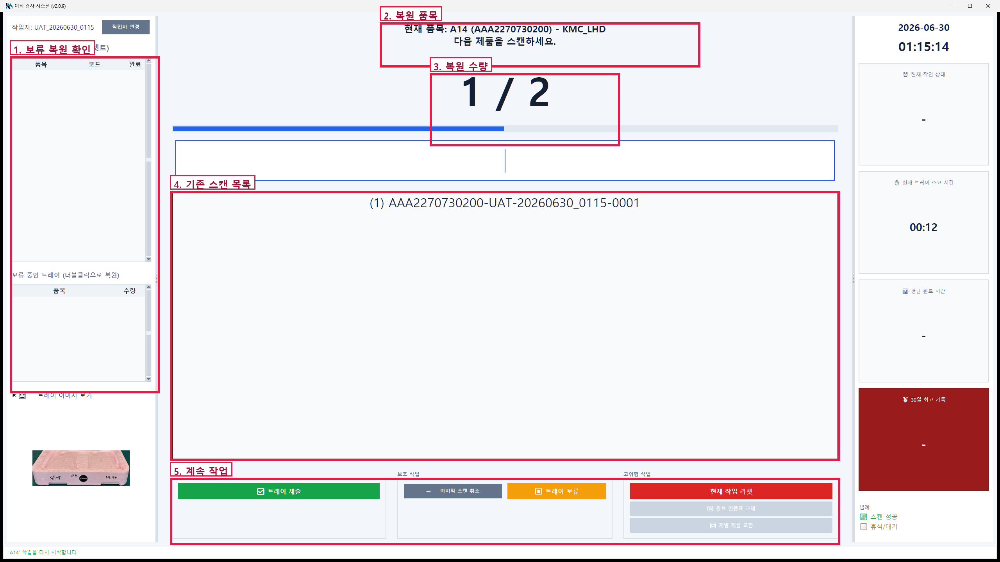

복원 방법:

1. 보류했던 현품표를 다시 스캔합니다.
2. 복원 확인창이 뜨면 내용을 확인합니다.
3. 이어서 작업할 것이 맞으면 `예`를 누릅니다.
4. 확신이 없으면 `아니오`를 누른 뒤 담당자에게 확인합니다.
5. 기존 스캔 수량이 복원된 상태에서 계속 스캔합니다.

보류한 트레이는 같은 현품표 QR을 다시 스캔해야 복원됩니다.

## 10. 종료 후 복구

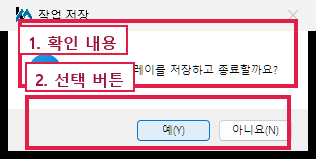

진행 중인 트레이가 있을 때 프로그램을 닫으면 저장 여부를 묻습니다.

계속 이어서 작업해야 하면:

1. 종료 확인에서 `확인`을 누릅니다.
2. 진행 중인 트레이 저장 질문에서 `예`를 누릅니다.
3. 다음 실행 때 같은 작업자로 시작합니다.
4. 이전 작업 복구 질문이 나오면 `예`를 누릅니다.

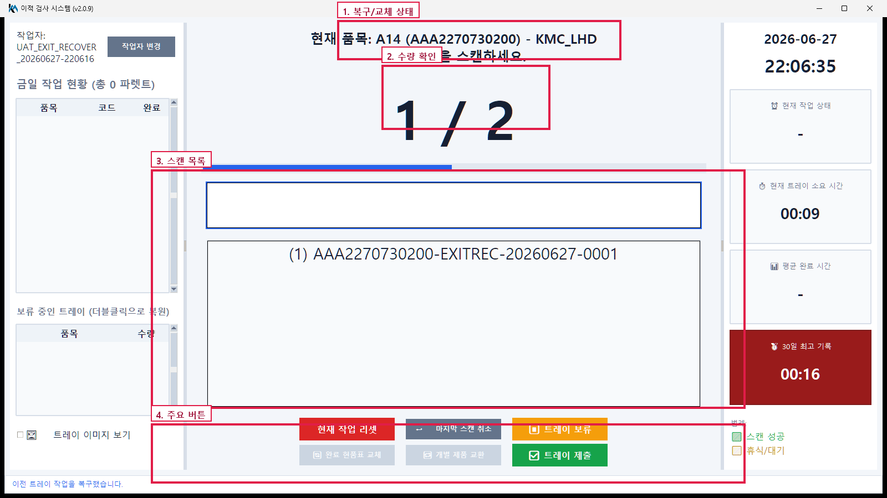

복구되면 이전에 찍은 제품 수량이 유지됩니다. 남은 제품을 스캔하면 정상 완료됩니다.

## 11. 작업자 변경 후 복구

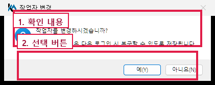

작업 중 `작업자 변경`을 누르면 진행 중인 트레이를 저장하고 로그인 화면으로 돌아갈 수 있습니다.

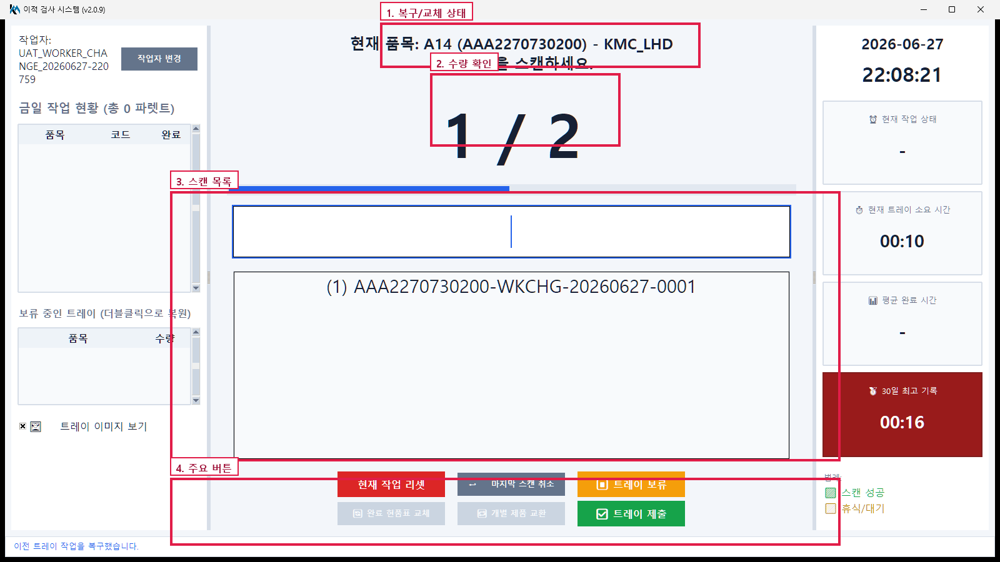

다시 같은 작업자로 시작하면 이전 작업을 복구할 수 있습니다. 이 흐름은 실제 화면에서 저장, 복원, 완료까지 확인했습니다.

## 12. 부분 제출

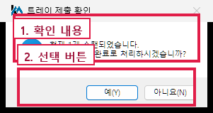

목표 수량을 다 채우지 않았는데 트레이를 제출해야 할 때 사용합니다.

사용할 때:

- 담당자 지시가 있을 때
- 실제 현장 사유로 미달 수량을 그대로 마감해야 할 때

주의:

- 부분 제출은 목표 수량 미달 상태를 완료로 마감하는 기능입니다.
- 제출 후에는 같은 트레이에 남은 제품을 계속 추가 스캔하는 일반 작업으로 돌아가지 않습니다.
- 부분 제출은 일반 자동 완료와 다르게 기록됩니다.
- 실수로 누르지 않도록 확인창 내용을 읽습니다.

## 13. 개별 제품 교환

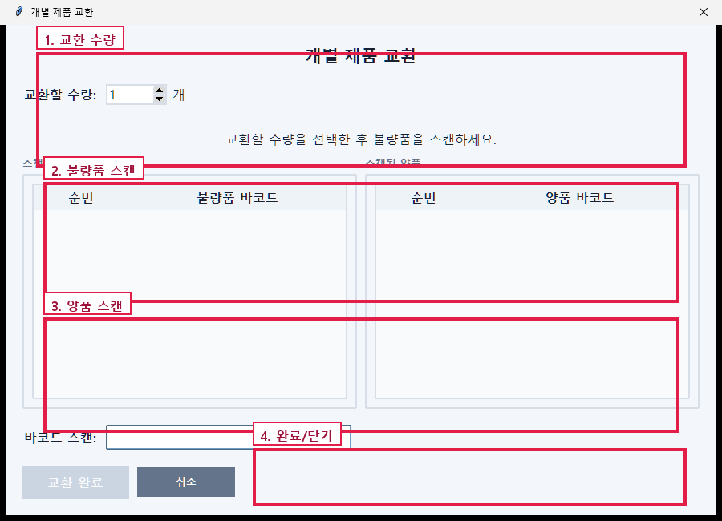

개별 제품 교환은 불량품과 양품을 교환할 때 사용합니다.

교환은 수량을 늘리는 기능이 아니라 기존 불량품 바코드를 새 양품 바코드로 대체 기록하는 기능입니다.

기본 흐름:

1. `개별 제품 교환`을 누릅니다.
2. 교환 수량을 확인합니다.
3. 불량품 바코드를 스캔합니다.
4. 양품 바코드를 스캔합니다.
5. 교환 완료를 누릅니다.

불량품을 먼저, 양품을 나중에 스캔합니다. 품목이 다르거나 중복이면 진행하지 말고 담당자에게 알립니다.

일반 작업자가 임의로 쓰는 기능이 아닙니다. 담당자 지시가 있을 때만 사용합니다.

## 14. 완료 현품표 교체

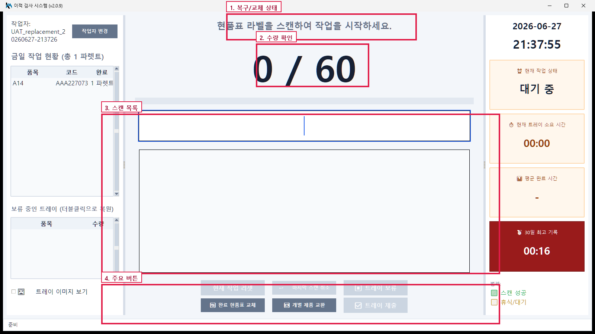

이미 완료된 작업의 현품표를 교체해야 할 때 사용하는 기능입니다.

주의:

- 진행 중인 트레이가 있으면 사용할 수 없습니다.
- 기존 완료 트레이의 품목, 수량, 제품 목록이 새 현품표와 같은 작업인지 담당자가 확인해야 합니다.
- 품목이나 수량이 다르면 교체하지 않습니다.
- 담당자 지시 없이 사용하지 않습니다.

## 15. 저장과 서버 전송

현장 작업 중 가장 중요한 저장 원칙은 다음입니다.

- 모든 작업은 먼저 이 PC의 로컬 저장소에 기록됩니다.
- 인터넷이 끊겨도 당일 작업은 계속할 수 있어야 합니다.
- 서버 연결이 가능하면 프로그램이 HTTPS로 서버에 업로드합니다.
- 배포 버전은 공유 폴더가 없어도 동작하는 것을 기준으로 합니다.

작업자는 별도 저장이나 업로드 버튼을 누르지 않습니다. 완료, 부분 제출, 교환, 교체 기록은 먼저 이 PC에 저장되고, 서버 연결이 되면 자동 전송됩니다. 서버 전송 오류나 미전송 표시가 계속 보이면 파일을 직접 열지 말고 담당자에게 알립니다.

아직 실제 현장 승인 전 남은 검증:

- 실제 USB/Bluetooth 스캐너로 같은 흐름 반복
- 승인된 HTTPS 서버 접수 확인
- 서버 당일 작업 조회 확인
- 과거 데이터 조회 확인
- 관리자 조회/내보내기 화면 확인

## 16. 검증된 실제 화면 시나리오

2026-06-30 packaged 실행 파일 전체화면 보류/복원 검증과 2026-06-27 보조 예외 시나리오 검증에서 PASS 확인한 항목입니다.

| 항목 | 결과 |
|---|---|
| 신규 작업자 no-preseed 시작 | PASS |
| 현품표 스캔 | PASS |
| 제품 스캔 | PASS |
| 목표 수량 자동 완료 | PASS |
| 제품-before-master 경고 후 복귀 | PASS |
| 잘못된 현품표 경고 | PASS |
| 품목 불일치 경고 후 복귀 | PASS |
| 중복 제품 경고 후 복귀 | PASS |
| 마지막 스캔 취소 | PASS |
| 현재 작업 리셋 | PASS |
| 트레이 보류/복원 | PASS |
| 종료/재실행 복구 | PASS |
| 작업자 변경 후 복구 | PASS |
| 부분 제출 | PASS |
| 개별 제품 교환 | PASS |
| 완료 현품표 교체 | PASS |

## 17. 게시자 메모

이 절은 문서를 OUTLINE에 게시하는 담당자용입니다. 현장 작업자 교육 자료로 배포할 때는 제외해도 됩니다.

OUTLINE 부모 문서:

- `https://wiki.kmtecherp.com/doc/8jsuydsp4hsgrag7zse66gc6re4656o-7EK8SbJ618`

기존 OUTLINE 문서:

- `https://wiki.kmtecherp.com/doc/container_audit-aJEkn1X2yH`

게시 결과:

- 2026-06-30 요소별 강조 박스와 보정 캡처를 기존 문서에 업데이트
- document id: `38dcd747-21d1-456f-852d-c929aa835e03`
- 업로드 이미지: 21장
- 게시 검증: Markdown 이미지 21개, attachment URL 21개, 로컬 상대 이미지 경로 0개
- 2026-06-30 로컬 최신화: packaged 실행 파일 DISPLAY2 전체화면 보류/복원 PASS, `docs/assets/container_audit_user_manual_20260630_annotated` 자산 추가
- 2026-06-30 재게시 시 모든 본문 이미지는 20260630 annotated 자산을 사용합니다. 새로 촬영된 로그인, 작업 시작, 현품표, 제품 스캔, 보류/복원, 완료 화면과 보정된 경고/예외 화면을 함께 포함합니다.

이미지 자산:

- `docs/assets/container_audit_user_manual_20260630_annotated`

게시 시 주의:

- OUTLINE에서 Mermaid가 코드로 보이면 `00-workflow.png`를 상단 대표 이미지로 사용합니다.
- 본문 이미지 링크는 OUTLINE attachment URL로 치환해야 합니다.
- 현장 배포 승인 전에는 실제 하드웨어 스캐너와 서버/downstream 검증이 남아 있다는 문장을 삭제하지 않습니다.
