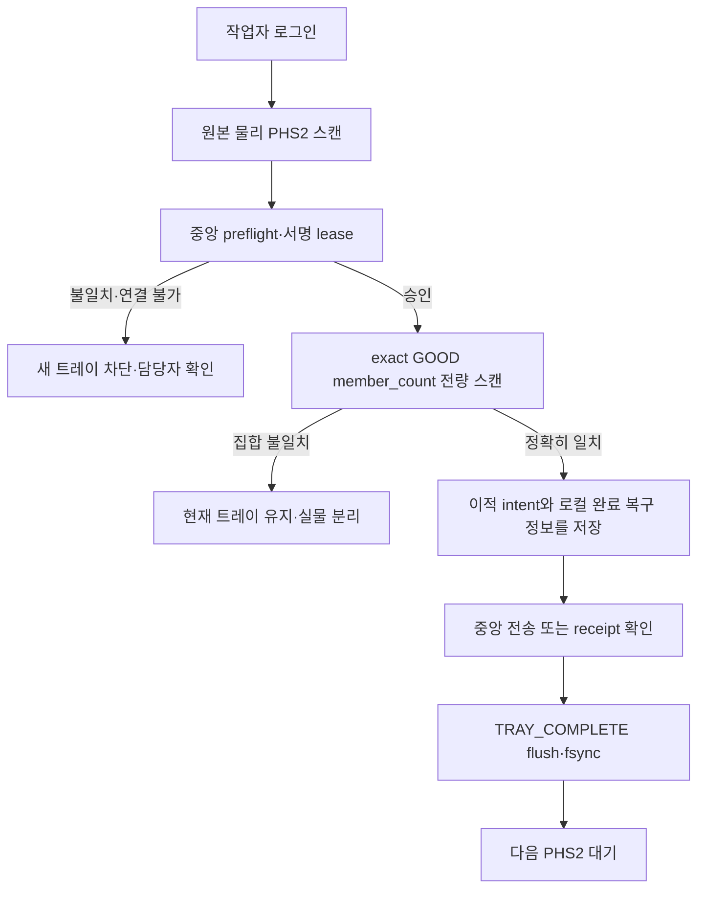

# 이적실 프로그램 사용 설명서

대상 프로그램: `Container_Audit`

적용 commit: `dc7c50dd6217e2a373d57704a6b9523862a5d7b8` (`Close durable preflight hold mutation gate`)

대상 사용자: 이적실 작업자와 작업 리더

현행 기준일: `2026-09-02`

이 문서는 표준 PHS2 작업의 현행 절차입니다. 핵심은 **원본 물리 PHS2 한 번 → 중앙 preflight와 서명 lease → 중앙 exact GOOD 멤버 전량 스캔 → 로컬 완료 정보 저장 → 현재 트레이의 중앙 이적 결과 확인**입니다.

> 화면 안내: 아래 사진은 2026-06-30 보존 캡처이며 적용 commit의 화면을 증명하지 않습니다. 로그인과 입력 위치를 찾는 참고로만 사용하고, 사진 속 수량·버전·예전 예외 버튼을 현행 절차의 근거로 삼지 마세요. 현행 증거는 아래 `M7 external capture bundle v1` 계약에 따라 외부 승인 묶음으로 교체할 예정입니다.

## 1. 한 건 처리 순서

1. 본인 작업자 이름으로 시작합니다.
2. 제품보다 먼저 **원본 물리 PHS2**를 한 번 스캔합니다.
3. 중앙 preflight가 끝날 때까지 기다립니다. 승인된 source, 현재 ACTIVE 라벨, 정확한 제품 집합과 서명 lease가 모두 맞아야 제품 입력이 열립니다.
4. 화면의 품목과 목표 수량을 실물과 대조합니다. 목표는 고정 수량이 아니라 중앙의 **exact GOOD `member_count`**입니다.
5. 화면에 속한 제품 바코드를 하나씩 스캔합니다. 같은 품목의 다른 제품으로 개수만 채우면 안 됩니다.
6. 전체 멤버가 정확히 일치하면 자동 완료됩니다. 표준 PHS2에는 부분 완료가 없습니다.
7. 완료 뒤 로컬 상태와 중앙 상태를 구분해 확인합니다. 재시도나 검토 상태이면 같은 제품이나 PHS2로 새 작업을 만들지 않습니다.

## 2. PHS2는 여섯 필드만 받습니다

표준 형식은 다음과 같습니다.

`PHS=2|SRC=KMTECH_INPUT_TAG|ITG=...|CLC=...|LBL=...|HSH=...`

- 필드 순서와 이름을 포함해 정확히 여섯 필드여야 합니다.
- `HSH`는 16자리 16진수 축약값입니다.
- `QT`나 그 밖의 필드가 붙은 QR은 표준 PHS2가 아닙니다.
- 복사본, 화면에 띄운 QR, 이적 완료 후 생긴 다른 seal QR로 시작하지 않습니다.

PHS2 한 번으로 중앙의 원본 source, 제품 ID↔바코드 대응, 품목·UOM, `member_count`, membership hash, 현재 위치와 라벨 버전을 가져옵니다. QR에 적힌 임의 수량이나 작업자의 추정 수량을 목표로 사용하지 않습니다.

## 3. 로그인과 preflight

1. 본인 이름을 입력하고 `작업 시작`을 누릅니다.
2. 신규 이름 확인창이 뜨면 철자를 확인합니다.
3. 제품이 아니라 원본 물리 PHS2를 먼저 스캔합니다.
4. 중앙 확인 중에는 다른 QR이나 제품을 찍지 않습니다.

preflight는 다음 항목을 한꺼번에 확인합니다.

- PHS2의 `ITG·CLC·LBL·HSH`와 immutable 원본·현재 ACTIVE 라벨 일치
- 중앙 `PHS_GOOD`의 제품 ID와 정규화 바코드 1:1 대응
- 중복 없는 exact membership, `member_count`, membership hash 일치
- 품목·UOM·회계 귀속, source와 작업 그룹 버전 일치
- 이 PC와 이 작업에 발급된 유효한 서명 lease

하나라도 다르면 새 트레이를 열지 않습니다. 같은 PHS2를 연속으로 찍어 통과시키려 하지 말고 현품표와 중앙 상태를 담당자에게 확인받으세요.

### preflight FIFO와 busy 상태별 재스캔

아래 `N`에는 화면의 실제 건수가 들어갑니다. `보류 N건`은 저장소에 접수된 입력이고, `이번 스캔은 접수되지 않았습니다.`를 포함한 문구는 해당 입력이 접수되지 않았다는 뜻입니다.

| 화면 문구 | 판정 | 작업자 행동 |
|---|---|---|
| `중앙에서 검사 완료 수량과 제품 구성을 확인하고 있습니다.` | 중앙 preflight 진행 중 | 새 QR이나 제품을 의도적으로 찍지 않고 결과를 기다립니다. |
| `중앙 확인 중 · 보류 스캔 N건` | 입력이 내구 보류 저장소에 접수됨 | 다시 찍지 않습니다. |
| `중앙 확인 완료 · 보류 N건 순서대로 처리 중` | 접수 순서대로 FIFO 처리 중 | 재스캔·리셋·보류·작업자 변경을 반복하지 않고 목록과 수량이 안정될 때까지 기다립니다. |
| `중앙 조회 실패 · 보류 N건 (삭제되지 않음)` | 접수된 입력이 그대로 보존됨 | 확인을 눌러 같은 PHS2의 중앙 조회만 다시 시작하고 제품을 다시 찍지 않습니다. |
| `이전 중앙 작업 처리 중입니다. 이번 현품표 입력은 접수되지 않았습니다.` | 새 PHS2가 접수되지 않음 | 이전 중앙 작업과 입력 잠금이 끝난 뒤 현재 트레이·목록을 확인하고 해당 PHS2만 한 번 다시 스캔합니다. |
| `중앙 조회 보류 묶음 처리 중입니다. 이번 작업은 접수되지 않았습니다.` | 보류 묶음이 다른 작업 상태 변경을 차단함 | 보류 묶음의 재확인·완료가 끝날 때까지 보류 작업 복원이나 현품표 교체 실행을 다시 누르지 않습니다. |
| `이번 스캔은 접수되지 않았습니다.`를 포함한 문구 | 해당 입력은 보류 저장소에 접수되지 않음 | busy와 입력 잠금이 끝난 뒤 목록·수량을 확인하고 그 실물만 한 번 다시 스캔합니다. |

`보류 스캔 N건`의 **접수**는 최종 제품 승인이라는 뜻이 아닙니다. FIFO head에서 형식·중복·품목·목표 수량을 다시 검증하며, 통과해 화면 목록과 수량에 반영된 제품만 인정합니다.

적용 commit에서는 활성 preflight 보류 묶음이 메모리뿐 아니라 내구 보류 파일에만 남아 있어도 `현재 작업 리셋`, `스캔 취소`, `트레이 보류`, `트레이 제출`, `운영 작업 ▾`, `작업자 변경`과 교체 버튼이 비활성화됩니다. 보류 묶음이 해결되기 전에 다른 방식으로 작업 상태를 바꾸지 않습니다.

`완료 처리 중`에는 스캔 입력과 작업 변경 버튼이 잠깁니다. `이전 중앙 작업 처리 중 · 이번 완료 요청은 접수되지 않았습니다.`가 표시되면 완료 버튼을 반복해서 누르지 말고 현재 트레이와 실물을 유지합니다.

## 4. 제품 전량 스캔

제품 한 개를 찍을 때마다 다음을 확인합니다.

- 목록에 방금 든 실물 바코드가 한 번만 추가됐는가
- 수량이 정확히 1 증가했는가
- 품목 불일치·중복·저장 실패 경고가 없는가

마지막 제품 뒤에는 모든 스캔을 중앙 `unit_id↔barcode` 표에 다시 맞춥니다. 스캔 집합이 lease에 고정된 제품 ID 집합과 완전히 같을 때만 자동 완료합니다. 중앙 exact GOOD `member_count`에 못 미치거나 다른 제품이 섞이면 완료하지 않습니다.

다음 현품표 대기 화면으로 돌아갔다고 중앙 ACK까지 끝났다고 단정하지 마세요. 아래 상태 표를 함께 확인해야 합니다.

### 제품 형식 오류가 나타나면

형식 오류가 난 제품은 목록과 수량에 추가되지 않습니다. 경고의 상황과 다음 행동을 확인하세요.

| 경고 상황 | 작업자 행동 |
|---|---|
| 품목코드보다 짧거나 같은 길이 | 제품 라벨 확인 후 다시 스캔합니다. 같은 오류가 계속되면 담당자에게 라벨 형식을 확인합니다. |
| 128자 초과 | 제품 라벨 형식을 담당자에게 확인합니다. |
| 앞뒤 공백 또는 제어 문자 | 스캐너 설정을 확인하고 다시 스캔합니다. |
| 허용되지 않는 시작 문자·문자 형식·경로 형식 | 제품 라벨과 스캐너 설정을 담당자에게 확인합니다. |
| 품목코드 길이 설정·스캔 기록·목표 수량 오류 | 관리자에게 문의합니다. |
| 현재 트레이의 품목 정보 없음 | 현품표를 확인합니다. |

라벨이나 설정을 확인하지 않은 채 같은 입력을 반복하지 마세요. 제품 바코드를 잘라내거나 문자를 바꾸어 통과시키지 않습니다. 위험한 원문은 경고에 표시하지 않으며 담당자는 기존 원인·길이 진단을 확인합니다.

## 5. 로컬 저장과 중앙 이적 확인을 구분합니다

작업자 화면은 내부 상태 코드를 그대로 표시하지 않고 아래 제목과 문구를 보여 줍니다.

| 화면 제목과 문구 | 내부 상태(화면에 표시되지 않음) | 작업자 행동 |
|---|---|---|
| `이적 연계 완료` / `이 PC에 이적 정보를 안전하게 저장했습니다.` | `LINKED` | 로컬 저장을 중앙 ACK로 오해하지 말고, 완료한 제품·같은 PHS2를 다시 찍지 않습니다. `새 현품표 스캔 가능 · 서버 자동 재시도`가 함께 표시된 경우에만 다음 원본 PHS2를 시작합니다. |
| `서버 이적 확인 완료` / `서버 이적 확인이 완료되었습니다.` | `ACKED` | 현재 트레이의 중앙 이적 ACK가 확인된 결과입니다. |
| `서버 이적 확인 대기` / `서버 이적 확인이 아직 완료되지 않았습니다. 자동 재시도를 기다려 주세요.` | `RETRY_WAIT` | 스캔을 멈추고 `서버 재확인`으로 같은 요청만 확인합니다. |
| `완료 기록 저장 재시도` / `완료 처리는 확정됐지만 기록 저장이 끝나지 않았습니다. 완료 기록 재시도를 눌러 주세요.` | `LOCAL_EVENT_RETRY` | 트레이를 유지하고 `완료 기록 재시도`를 사용합니다. |
| `완료 확인 필요` / `서버 판정 미완료 · 완료 처리 중지 · 트레이·목록 유지 · 담당자 확인` | `OPERATOR_REVIEW` | 실물·트레이·목록을 유지하고 담당자를 부릅니다. |

`TRAY_COMPLETE`, `LINKED`, 중앙 ACK, 분석용 DirectSync 업로드는 서로 다른 내부 증거입니다. 화면의 한 성공 문구로 나머지까지 완료됐다고 판단하지 않습니다.

`이적 연계 완료` 뒤 중앙 장애나 사후 충돌이 생겨도 로컬에 저장된 완료 정보를 임의로 지우지 않습니다. 응답을 잃은 경우 프로그램이 저장된 같은 요청을 재확인하므로 재스캔하지 않습니다.

### `저장 전송` 카드와 현재 트레이 ACK

오른쪽 `저장 전송` 카드는 DirectSync 전송 대기열을 보여 줍니다. 현재 트레이의 중앙 이적 결과와는 별도입니다.

| 화면 문구 | 뜻 | 작업자 행동 |
|---|---|---|
| `대기 N · 최근 성공 ...` | DirectSync의 `pending`·`retry_wait`·`leased` 합계와 가장 최근 업로드 ACK | 제품 수량이 아니므로 제품이나 PHS2를 다시 찍지 않습니다. |
| `정상 대기` | DirectSync backlog가 있으나 담당자 확인 상태는 아님 | 현재 트레이 이적 결과와 별도로 기다립니다. |
| `저장 상태 확인 필요 · N건` | 영구 실패 또는 담당자 확인 항목이 있음 | 파일을 고치거나 지우지 말고 `전송 상태 상세`의 `대기`, `영구 실패`, `담당자 확인`, `가장 오래된 대기`, `마지막 ACK`, `상태`를 기록해 담당자에게 알립니다. |
| `서버 이적 확인 완료` / `서버 이적 확인이 완료되었습니다.` | 현재 트레이의 중앙 이적 ACK가 확인됨 | 이 문구로 현재 트레이 결과를 판단합니다. |

따라서 `저장 전송` 카드의 `최근 성공`·`마지막 ACK`만 보고 현재 트레이가 이적 완료됐다고 판단하지 않습니다.

## 6. 네트워크와 lease 경계

- **PHS2 시작 전 오프라인:** exact source와 서명 lease를 받을 수 없으므로 새 트레이를 시작할 수 없습니다.
- **정상 preflight 뒤 오프라인:** 아직 유효한 lease와 로컬 저장소가 있으면 로컬 완료 정보와 `TRAY_COMPLETE`를 남길 수 있습니다. 중앙 반영은 저장된 같은 명령으로 재시도합니다.
- **lease 없음·만료·변조 또는 SQLite/CSV 저장 실패:** 완료하지 않습니다. 현재 트레이와 실물을 그대로 유지하고 담당자를 부릅니다.

서버가 늦다고 제품을 다시 스캔하거나 같은 PHS2로 새 트레이를 만들면 안 됩니다.

## 7. 경고가 나오면

### 현품표보다 제품을 먼저 찍음

경고를 닫고 원본 물리 PHS2부터 시작합니다.

### 품목 또는 멤버 불일치

해당 제품을 정상 제품과 분리합니다. 같은 품목처럼 보여도 중앙 exact membership에 없으면 수량으로 인정하지 않습니다.

### 중복 스캔

목록에 이미 있는지 확인하고 다음 정상 제품을 찍습니다. 중복 제품을 다른 PC에서 다시 처리하지 않습니다.

### 저장 또는 중앙 상태 불명확

성공 화면으로 넘어가지 않았다면 실물을 움직이지 않습니다. `서버 이적 확인 대기`이면 같은 요청의 확인을 기다리고, `완료 확인 필요`이면 담당자 확인 전 재처리하지 않습니다.

## 8. 취소·리셋·보류·복원

`스캔 취소`는 자동 완료 전에 방금 찍은 한 개만 되돌립니다. 무엇을 찍었는지 확실하지 않으면 사용하지 마세요.

`현재 작업 리셋`은 진행 중인 미완료 트레이를 버리는 기능입니다. 이미 `이적 연계 완료`로 저장된 완료 정보를 되돌리는 기능이 아닙니다.

다른 작업을 먼저 해야 할 때만 `트레이 보류`를 사용합니다. startup의 `이전 작업 복구`에서 `아니오`를 선택한 경우에도 이전 트레이는 삭제되지 않고 보류 목록으로 이동합니다.

보류 작업을 다시 시작하는 순서는 다음과 같습니다.

1. **같은 작업자**로 로그인합니다.
2. 왼쪽의 `보류 N건 보기`를 누릅니다.
3. `보류 작업 N건 (더블클릭으로 복원)` 목록에서 `품목명`과 `스캔 수량`을 확인합니다.
4. 해당 행을 더블클릭합니다.
5. 복원된 품목·스캔 목록·수량을 보존해 둔 실물과 대조한 뒤 남은 제품만 스캔합니다.

다른 작업자의 보류 트레이는 목록에 나오지 않으며 임의로 삭제하거나 인수하지 않습니다.

두 확인창의 `아니오`는 결과가 서로 다릅니다. 반드시 창 제목부터 확인합니다.

| 창 제목 | `예` | `아니오` | `취소` 또는 창 닫기 |
|---|---|---|---|
| `이전 작업 복구` | 이전 트레이를 계속 작업합니다. | 이전 트레이를 **보류하고 새 작업**을 시작합니다. 삭제하지 않습니다. | 상태를 바꾸지 않고 로그인 화면으로 돌아갑니다. |
| `작업 전환 확인` | 이어지는 `트레이 보류 확인`에서 확정하면 현재 트레이를 보류한 뒤 선택한 작업을 복원합니다. | **현재 트레이를 삭제**한 뒤 선택한 작업을 복원합니다. | 현재 트레이와 보류 작업을 바꾸지 않습니다. |

저장된 완료 재시도·담당자 확인 상태가 함께 있으면 프로그램이 `이전 작업 복구` 선택창을 생략하고 해당 트레이를 강제로 복원합니다. 이때는 `완료 기록 저장 재시도` 또는 `완료 확인 필요` 안내를 따라 트레이·목록·실물을 유지합니다.

parked 트레이와 `보류 스캔 N건`은 삭제 대기 항목이 아니라 복원·FIFO 처리를 위해 보존된 상태입니다. 파일을 직접 지우거나 이름을 바꾸지 않습니다.

종료 또는 작업자 변경 전에는 저장 확인을 따릅니다. 복구 화면의 수량과 실물을 대조하기 전 제품을 추가로 찍지 않습니다.

## 9. 제품 교체는 이적 확정 전 1~2쌍만 합니다

표준 제품 교환은 **작업 리더 지시에 따라** 이적 확정 전에 수행합니다. 새 양품은 대상과 같은 입고 lot·품목·UOM·원장 plane의 별도 PHS에 속해야 하며, 기존 제품↔새 제품 **1~2쌍**만 원자적으로 바꿉니다. 한 쌍이라도 검증이나 저장에 실패하면 전부 반영하지 않습니다. 완료 뒤 여러 제품을 임의로 바꾸는 기능이 아닙니다.

표준 PHS2에서는 기존 `완료 현품표 교체` 흐름을 사용하지 않습니다. exact 이적 모드에서는 버튼이 `중앙 교체 워크플로 필요`로 차단되며, 기존 흐름을 시도하면 `관리자 교체 절차 필요`가 표시됩니다. 화면 안내대로 담당자에게 알리고, 이미 봉인된 이적·포장 작업을 임의로 바꾸지 않습니다.

## 10. 레거시 화면 부록

다음 자료는 버튼 위치와 과거 화면 이력을 보존하기 위한 것입니다. 현행 표준 PHS2 절차로 실행하지 않습니다.

- 과거 고정 수량 규칙: 중앙 exact GOOD `member_count`를 쓰는 현행 기준과 다릅니다.
- 추가 `QT` 필드가 있는 QR: 현행 여섯 필드 PHS2가 아닙니다.
- 일부 수량을 완료로 닫는 화면: 표준 PHS2의 부분 완료 금지와 다릅니다.
- 완료 뒤 여러 제품을 교환하는 흐름: 이적 확정 전 같은 품목 1~2쌍 원자 교환과 다릅니다.

이 화면은 **레거시 증거**입니다. 일반 작업이나 담당자 지시로 표준 PHS2를 부분 제출해서는 안 됩니다.

## 11. M7 external capture bundle v1

정본은 `E:/KMTech/production-readiness-20260830/HANDOVER/CAPTURE-BUNDLE-V1-CONTRACT.md`이고 현행 화면 증거의 스키마 이름은 정확히 `M7 external capture bundle v1`입니다. 승인 묶음은 앱 저장소 밖의 `D:/KMTech/cold-program-material/from-E/requal-evidence/capture-bundle-v1/<app>/<app>__<commit12>__<YYYYMMDDTHHMMSSZ>__<nonce8>/`에 둡니다. `HANDOVER-INDEX.md`가 가리키는 불변 `indexes/handover-index__<YYYYMMDDTHHMMSSZ>__<nonce8>.json`에서 `app=Container_Audit` 항목을 찾고 bundle `manifest.json`의 `captures[].state_id`로 조회합니다. 저장소에서는 GUI를 열지 않는 `python -B tools/capture_container_operator_ui.py --describe-m7-contract`의 `{schema, app, required_state_ids}` envelope로 같은 선언을 확인합니다.

디렉터리·파일명, manifest field와 create-new 순서는 위 정본만 따릅니다. 이 문서에는 그 계약을 재정의하거나 아직 만들어지지 않은 digest를 적지 않습니다. 캡처 승인자 직책과 캡처·게시 evidence owner 값은 `미정 — 조직 확정 필요(Q1)`이며, 확정 전에는 승인 완료로 판정하지 않습니다.

필수 state ID는 다음 아홉 개입니다.

1. `m7_phs2_preflight` — exact six-field PHS2, preflight 진행·차단
2. `m7_central_preflight_queue` — 중앙 확인 중/완료/실패, 이전 중앙 작업 처리 중, 이번 스캔 미접수
3. `m7_completion_busy` — 완료 처리 중, 이번 완료 요청 미접수, preflight 보류 중 control 비활성
4. `m7_recovery_transition` — 이전 작업 복구, 작업 전환 확인, 보류 작업 N건 복원
5. `m7_direct_sync_backlog_ack` — 저장 전송 backlog/최근 ACK, 현재 트레이 이적 확인
6. `m7_exact_good_membership` — 중앙 exact GOOD `member_count`, 제품 ID↔바코드 대조
7. `m7_lease_fail_closed` — lease 발급 실패/만료, 시작 전 오프라인 차단
8. `m7_transfer_receipt_status` — 이적 연계 완료/서버 확인 완료·대기/로컬 기록 재시도/확인 필요
9. `m7_partial_atomic_exchange` — 표준 부분 완료 차단, 같은 품목 1~2쌍 원자 교환

기존 추적 이미지는 삭제하지 않고 역사 참고 자료로 유지합니다. 최종 portable artifact에서 위 아홉 state를 외부 묶음으로 캡처하고 승인한 뒤에만 현행 화면 증거를 교체하며, 그전까지 절차와 상태 판단은 이 문서 본문을 따릅니다.

### C-1~C-5 처리표

| ID | 분류 | 처리 |
|---|---|---|
| C-1 | `external bundle 캡처 대기(재감사 통과 전 '도구 준비됨' 표기 금지)` | 도구 정정은 진행 중이며, 장면별 production 호출과 fake-free 문구 assertion을 재감사하기 전에는 도구 준비 완료로 간주하지 않습니다. PNG 생성과 최종 artifact 캡처·승인은 이 문서 변경의 범위 밖입니다. |
| C-2 | `미정 — 조직 확정 필요(Q1)` | 캡처 승인자 직책은 정하지 않았으며 조직 결정 전 미정입니다. |
| C-3 | `미정 — 조직 확정 필요(Q1)` | 캡처·게시 evidence owner는 정하지 않았으며 조직 결정 전 미정입니다. |
| C-4 | `도구 정정 진행(재감사 대기)` | 도구의 실제 production call trace, production validator 호출, variant별 assertion 및 정본 manifest 생성을 정정했으며 독립 재감사 전에는 닫지 않습니다. |
| C-5 | `부분 존재(아카이브)` | 코디네이터 직접 확인(D-121, 2026-09-03) 결과, 아래 세 원본 경로는 부재하지만 회사 프로그램 아카이브에 원래 캡처 세트 10개(9 PNG + 1 JSON)가 남아 있습니다. 이 자료는 historical evidence일 뿐 현행 승인 묶음은 아닙니다. |

C-5에서 확인한 원본 경로:

- `C:\company\program\Container_Audit\.tmp\ui-validation-secondary-20260625-165416\ui_validation_report.json`
- `C:\company\program\Container_Audit\.tmp\ui-validation-secondary-20260625-165416\screenshots`
- `C:\company\program\.deploy_backups\Container_Audit_local_state_20260625-124732\.codex\uiux-captures\20260623-213546-full-uiux-background`

아카이브에서 확인된 경로는 `E:\KMTech\company-program-archive-20260821-postreboot\moved-unique\.deploy_backups\Container_Audit_local_state_20260625-124732\.codex\uiux-captures\20260623-213546-full-uiux-background`입니다.
