# 이적실 프로그램 사용 설명서

대상 프로그램: `Container_Audit v2.0.52`

대상 사용자: 이적실 작업자와 작업 리더

현행 기준일: `2026-08-03`

이 문서는 표준 PHS2 작업의 현행 절차입니다. 핵심은 **원본 물리 PHS2 한 번 → 중앙 preflight와 서명 lease → 중앙 exact GOOD 멤버 전량 스캔 → 로컬 `LINKED` → 중앙 결과 확인**입니다.

> 화면 안내: 아래 사진은 2026-06-30 보존 캡처입니다. 로그인, 스캔 위치, 경고창의 위치를 찾는 데만 사용하세요. `v2.0.52`의 PHS2 preflight, lease, exact membership, `LINKED`·`ACKED`·`RETRY_WAIT`·`OPERATOR_REVIEW`를 보여 주는 **현재 캡처 필요** 상태입니다. 사진의 수량과 예전 예외 버튼을 현행 절차의 근거로 삼지 마세요.

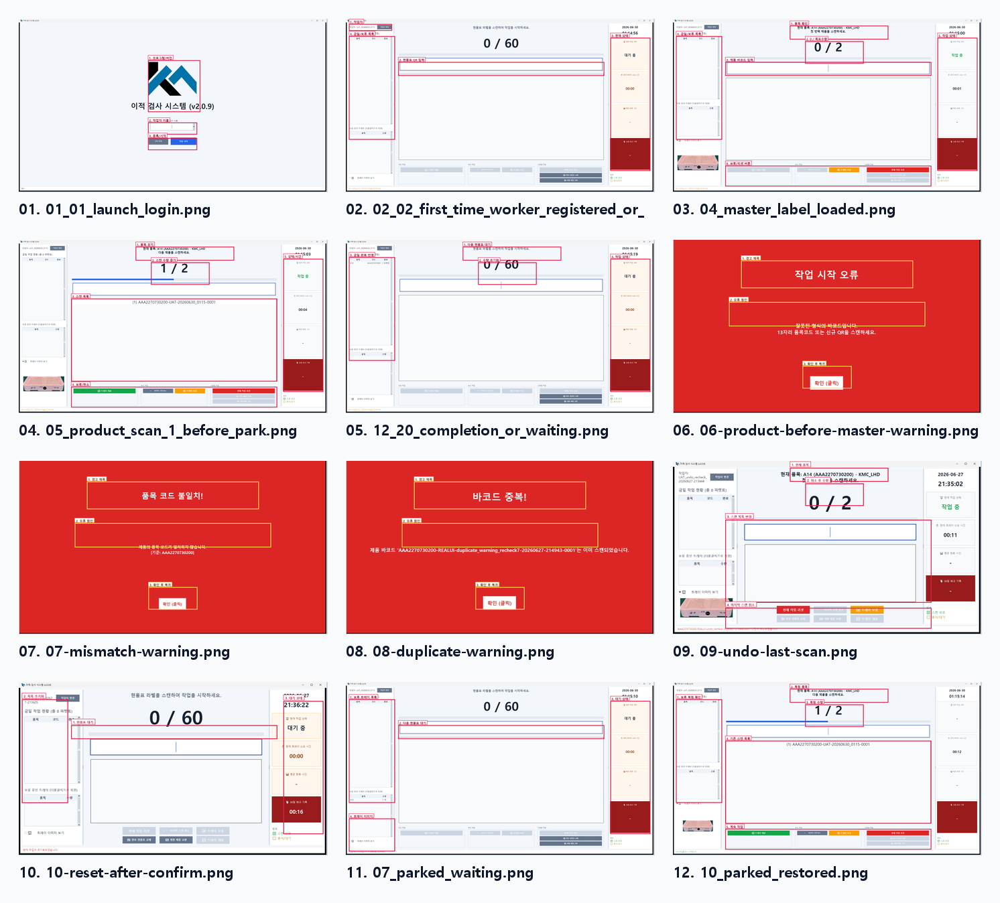

## 1. 한 건 처리 순서

1. 본인 작업자 이름으로 시작합니다.
2. 제품보다 먼저 **원본 물리 PHS2**를 한 번 스캔합니다.
3. 중앙 preflight가 끝날 때까지 기다립니다. 승인된 source, 현재 ACTIVE 라벨, 정확한 제품 집합과 서명 lease가 모두 맞아야 제품 입력이 열립니다.
4. 화면의 품목과 목표 수량을 실물과 대조합니다. 목표는 고정 수량이 아니라 중앙의 **exact GOOD `member_count`**입니다.
5. 화면에 속한 제품 바코드를 하나씩 스캔합니다. 같은 품목의 다른 제품으로 개수만 채우면 안 됩니다.
6. 전체 멤버가 정확히 일치하면 자동 완료됩니다. 표준 PHS2에는 부분 완료가 없습니다.
7. 완료 뒤 로컬 상태와 중앙 상태를 구분해 확인합니다. 재시도나 검토 상태이면 같은 제품이나 PHS2로 새 작업을 만들지 않습니다.

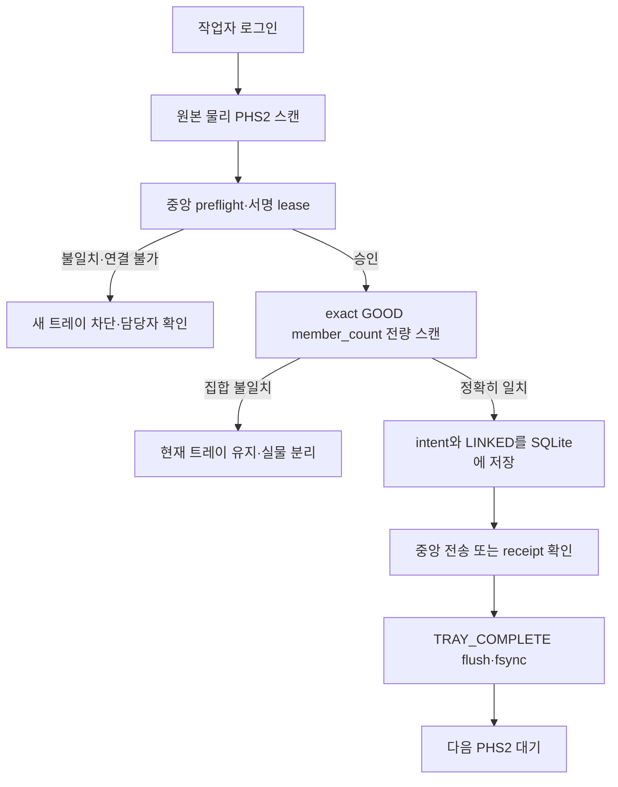

## 2. PHS2는 여섯 필드만 받습니다

표준 형식은 다음과 같습니다.

`PHS=2|SRC=KMTECH_INPUT_TAG|ITG=...|CLC=...|LBL=...|HSH=...`

- 필드 순서와 이름을 포함해 정확히 여섯 필드여야 합니다.
- `HSH`는 16자리 16진수 축약값입니다.
- `QT`나 그 밖의 필드가 붙은 QR은 표준 PHS2가 아닙니다.
- 복사본, 화면에 띄운 QR, 이적 완료 후 생긴 다른 seal QR로 시작하지 않습니다.

PHS2 한 번으로 중앙의 원본 source, 제품 ID↔바코드 대응, 품목·UOM, `member_count`, membership hash, 현재 위치와 라벨 버전을 가져옵니다. QR에 적힌 임의 수량이나 작업자의 추정 수량을 목표로 사용하지 않습니다.

## 3. 로그인과 preflight

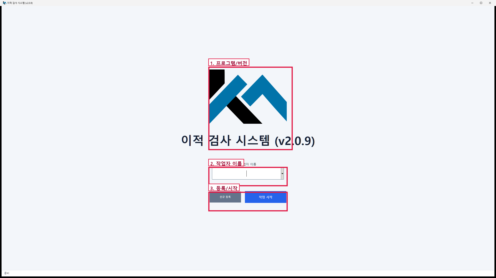

1. 본인 이름을 입력하고 `작업 시작`을 누릅니다.
2. 신규 이름 확인창이 뜨면 철자를 확인합니다.
3. 제품이 아니라 원본 물리 PHS2를 먼저 스캔합니다.
4. 중앙 확인 중에는 다른 QR이나 제품을 찍지 않습니다.

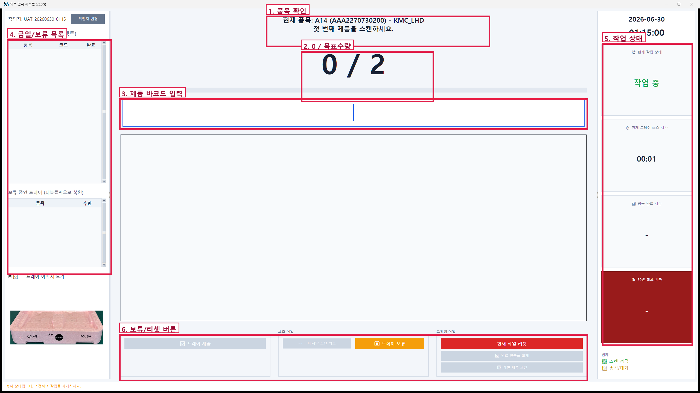

preflight는 다음 항목을 한꺼번에 확인합니다.

- PHS2의 `ITG·CLC·LBL·HSH`와 immutable 원본·현재 ACTIVE 라벨 일치
- 중앙 `PHS_GOOD`의 제품 ID와 정규화 바코드 1:1 대응
- 중복 없는 exact membership, `member_count`, membership hash 일치
- 품목·UOM·회계 귀속, source와 작업 그룹 버전 일치
- 이 PC와 이 작업에 발급된 유효한 서명 lease

하나라도 다르면 새 트레이를 열지 않습니다. 같은 PHS2를 연속으로 찍어 통과시키려 하지 말고 현품표와 중앙 상태를 담당자에게 확인받으세요.

## 4. 제품 전량 스캔

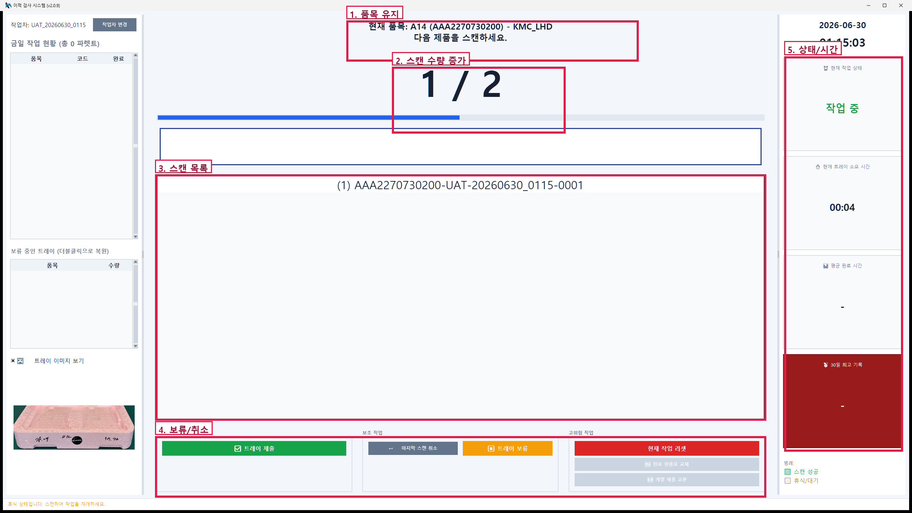

제품 한 개를 찍을 때마다 다음을 확인합니다.

- 목록에 방금 든 실물 바코드가 한 번만 추가됐는가
- 수량이 정확히 1 증가했는가
- 품목 불일치·중복·저장 실패 경고가 없는가

마지막 제품 뒤에는 모든 스캔을 중앙 `unit_id↔barcode` 표에 다시 맞춥니다. 스캔 집합이 lease에 고정된 제품 ID 집합과 완전히 같을 때만 자동 완료합니다. 중앙 exact GOOD `member_count`에 못 미치거나 다른 제품이 섞이면 완료하지 않습니다.

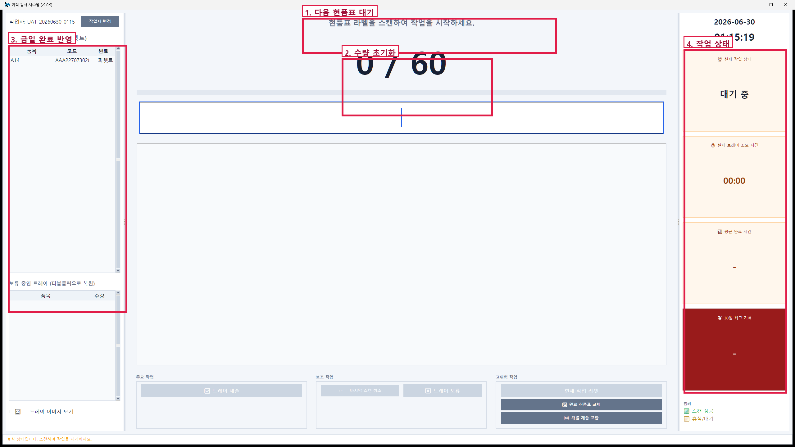

다음 현품표 대기 화면으로 돌아갔다고 중앙 ACK까지 끝났다고 단정하지 마세요. 아래 상태 표를 함께 확인해야 합니다.

## 5. 로컬 완료와 중앙 상태를 구분합니다

| 표시 | 뜻 | 작업자 행동 |
|---|---|---|
| `LINKED` | deterministic intent와 실물 완료 사실을 같은 SQLite transaction에 저장함 | 중앙 완료와 혼동하지 말고 상태를 확인합니다. |
| `ACKED` | 중앙이 같은 명령을 승인했고 receipt가 확인됨 | 다음 작업을 진행할 수 있습니다. |
| `RETRY_WAIT` | 일시 장애 또는 ACK 유실로 같은 저장 명령을 재확인 중 | 재스캔·새 트레이 생성 없이 자동 재시도를 기다립니다. |
| `OPERATOR_REVIEW` | 중앙 충돌 또는 receipt 모순으로 사람 확인이 필요함 | 실물을 분리하고 담당자를 부릅니다. |

`TRAY_COMPLETE`는 로컬 이벤트 CSV에 동기 flush·fsync된 완료 원본입니다. `LINKED`, `TRAY_COMPLETE`, 중앙 ACK, 분석용 direct-sync 업로드는 서로 다른 사실입니다. 하나의 성공 표시로 나머지까지 완료됐다고 판단하지 않습니다.

이미 `LINKED`가 있으면 중앙 장애나 사후 충돌 때문에 로컬 실물 완료를 지우지 않습니다. 응답을 잃은 경우 저장된 idempotency key로 receipt를 먼저 조회하고 같은 명령만 재시도합니다.

## 6. 네트워크와 lease 경계

- **PHS2 시작 전 오프라인:** exact source와 서명 lease를 받을 수 없으므로 새 트레이를 시작할 수 없습니다.
- **정상 preflight 뒤 오프라인:** 아직 유효한 lease와 로컬 저장소가 있으면 `LINKED`와 `TRAY_COMPLETE`까지 남길 수 있습니다. 중앙 반영은 같은 명령으로 재시도합니다.
- **lease 없음·만료·변조 또는 SQLite/CSV 저장 실패:** 완료하지 않습니다. 현재 트레이와 실물을 그대로 유지하고 담당자를 부릅니다.

서버가 늦다고 제품을 다시 스캔하거나 같은 PHS2로 새 트레이를 만들면 안 됩니다.

## 7. 경고가 나오면

### 현품표보다 제품을 먼저 찍음

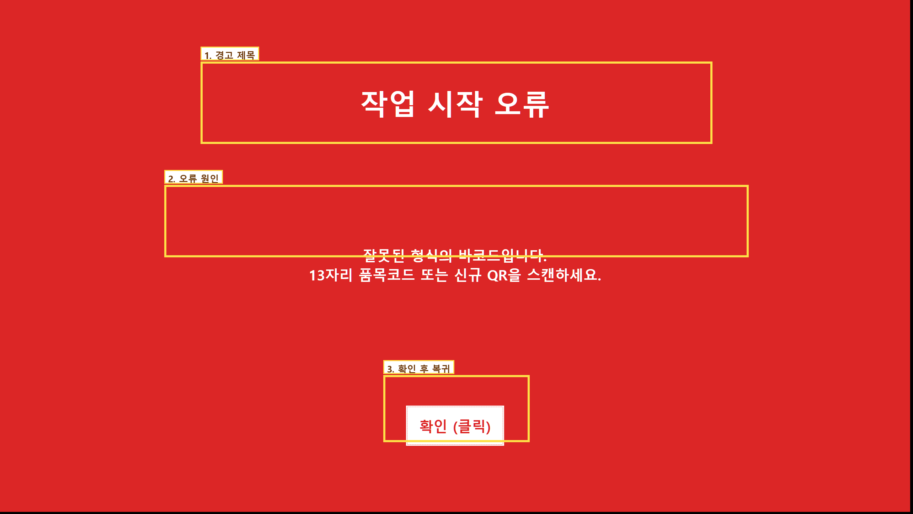

경고를 닫고 원본 물리 PHS2부터 시작합니다.

### 품목 또는 멤버 불일치

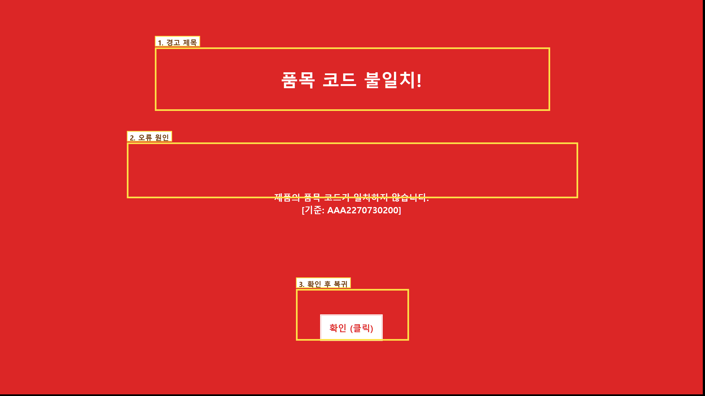

해당 제품을 정상 제품과 분리합니다. 같은 품목처럼 보여도 중앙 exact membership에 없으면 수량으로 인정하지 않습니다.

### 중복 스캔

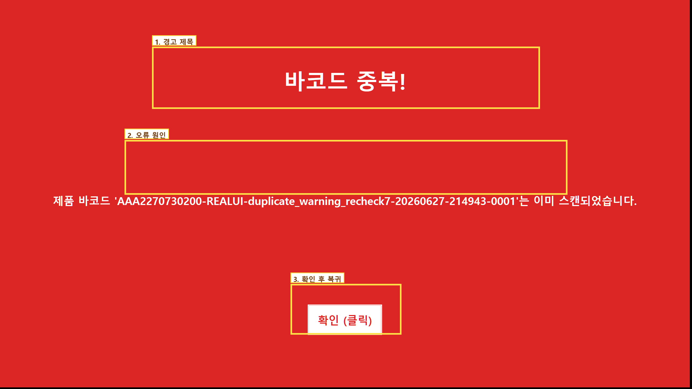

목록에 이미 있는지 확인하고 다음 정상 제품을 찍습니다. 중복 제품을 다른 PC에서 다시 처리하지 않습니다.

### 저장 또는 중앙 상태 불명확

성공 화면으로 넘어가지 않았다면 실물을 움직이지 않습니다. `RETRY_WAIT`이면 같은 요청의 receipt를 기다리고, `OPERATOR_REVIEW`이면 담당자 확인 전 재처리하지 않습니다.

## 8. 취소·리셋·보류·복원

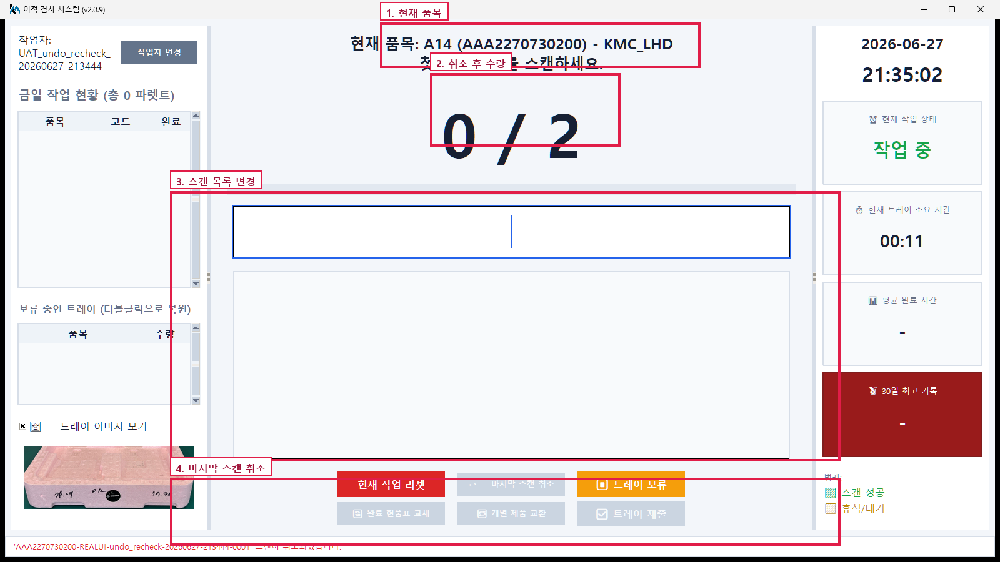

`마지막 스캔 취소`는 자동 완료 전에 방금 찍은 한 개만 되돌립니다. 무엇을 찍었는지 확실하지 않으면 사용하지 마세요.

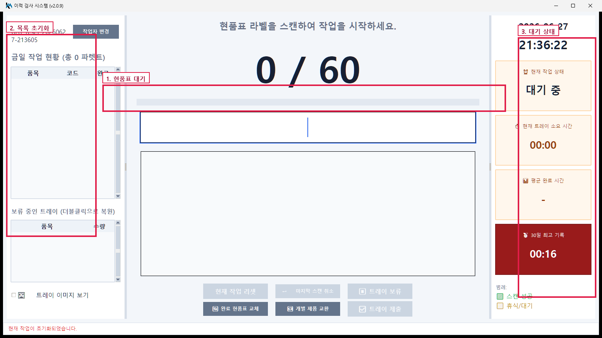

`현재 작업 리셋`은 진행 중인 미완료 트레이를 버리는 기능입니다. 완료된 `LINKED` intent를 되돌리는 기능이 아닙니다.

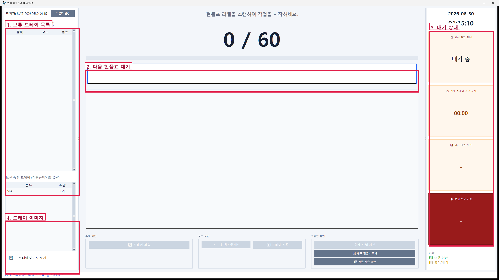

다른 작업을 먼저 해야 할 때만 트레이를 보류합니다. 같은 작업자의 같은 원본 PHS2로 돌아와 복원합니다.

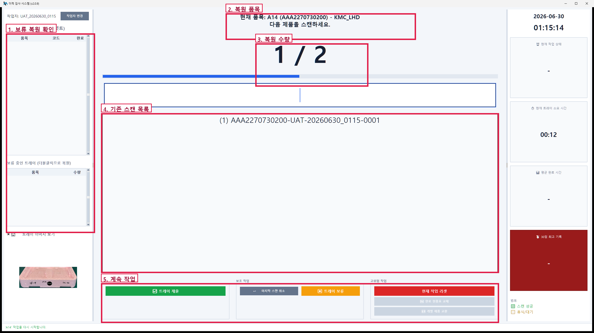

복원된 멤버와 수량을 실물에 다시 맞춘 뒤 남은 제품을 스캔합니다. 다른 작업자의 보류 트레이를 임의로 삭제하거나 인수하지 않습니다.

종료 또는 작업자 변경 전에는 저장 확인을 따릅니다. 복구 화면의 수량과 실물을 대조하기 전 제품을 추가로 찍지 않습니다.

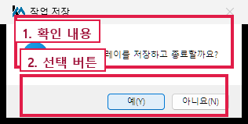

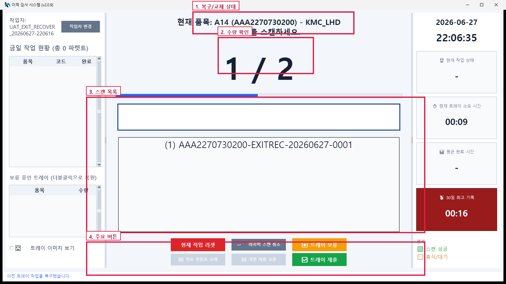

## 9. 교환과 현품표 교체는 리더 지시로만 합니다

표준 제품 교환은 이적 확정 전에 같은 품목의 기존 제품↔새 제품 **1~2쌍**만 원자적으로 바꿉니다. 한 쌍이라도 검증이나 저장에 실패하면 전부 반영하지 않습니다. 완료 뒤 여러 제품을 임의로 바꾸는 기능이 아닙니다.

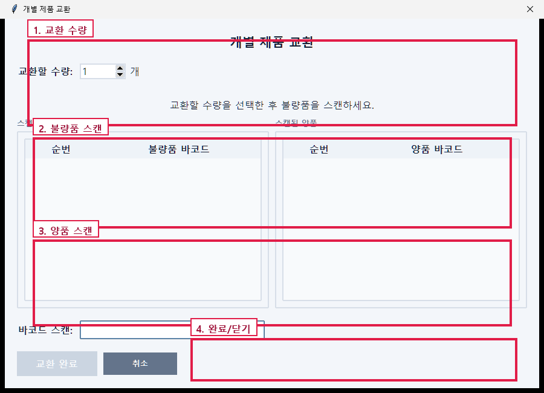

현품표 교체는 기존 완료 작업의 품목·멤버·수량과 새 라벨이 모두 맞고 중앙 활성화가 확인될 때만 진행합니다. 중간 종료 시 recovery journal을 기준으로 이어 갑니다.

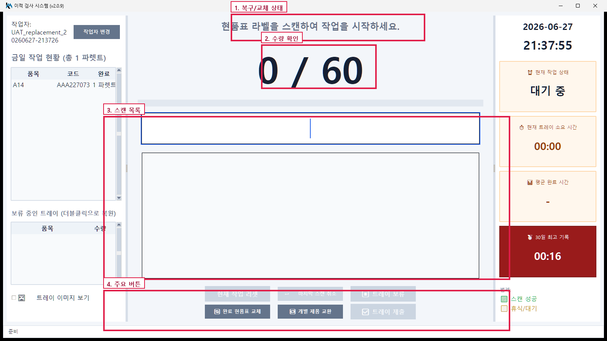

## 10. 레거시 화면 부록

다음 자료는 버튼 위치와 과거 화면 이력을 보존하기 위한 것입니다. 현행 표준 PHS2 절차로 실행하지 않습니다.

- 과거 고정 수량 규칙: 중앙 exact GOOD `member_count`를 쓰는 현행 기준과 다릅니다.
- 추가 `QT` 필드가 있는 QR: 현행 여섯 필드 PHS2가 아닙니다.
- 일부 수량을 완료로 닫는 화면: 표준 PHS2의 부분 완료 금지와 다릅니다.
- 완료 뒤 여러 제품을 교환하는 흐름: 이적 확정 전 같은 품목 1~2쌍 원자 교환과 다릅니다.

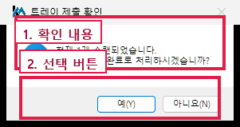

이 화면은 **레거시 증거**입니다. 일반 작업이나 담당자 지시로 표준 PHS2를 부분 제출해서는 안 됩니다.

## 11. 현재 캡처 필요

게시 전 다음 `v2.0.52` 화면을 새로 촬영해 보존 이미지를 교체해야 합니다.

- exact six-field PHS2 스캔과 preflight 진행·차단
- 중앙 exact GOOD `member_count`와 제품 ID↔바코드 대조
- lease 발급 실패·만료와 시작 전 오프라인 차단
- `LINKED`, `ACKED`, `RETRY_WAIT`, `OPERATOR_REVIEW` 상태
- 표준 부분 완료 차단과 같은 품목 1~2쌍 원자 교환

현재 캡처가 준비되기 전까지 기존 사진은 화면 위치 안내로만 사용하고, 절차와 상태 판단은 이 문서 본문을 따릅니다.
